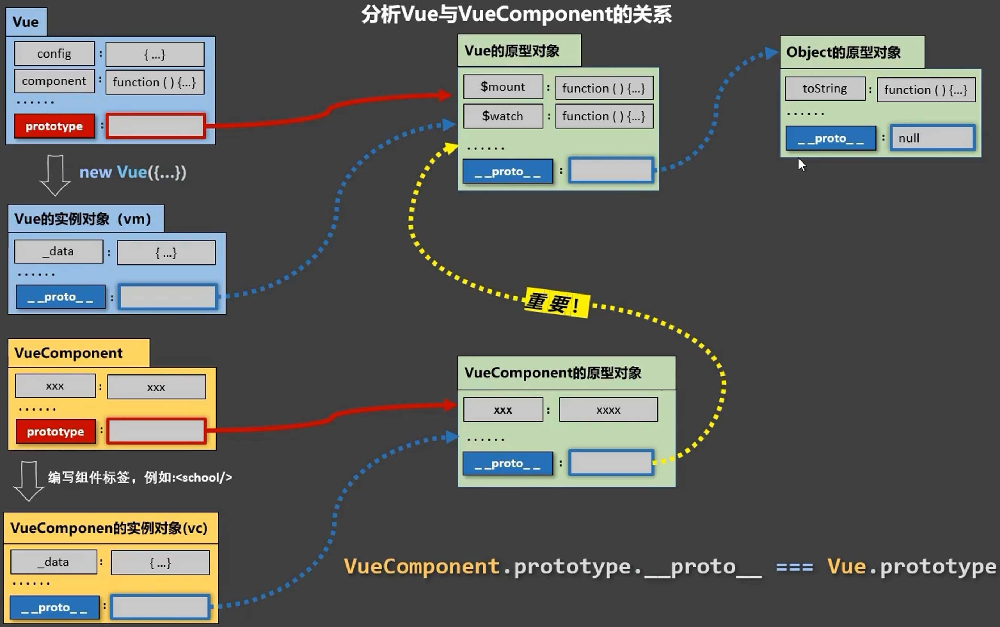

# Vue 组件化编程


## 1. 模块与组件、模块化与组件化

### 1.1. 模块

理解: 向外提供特定功能的 js 程序, 一般就是一个 js 文件

为什么: js 文件很多很复杂

作用: 复用 js, 简化 js 的编写, 提高 js 运行效率

### 1.2. 组件

理解: 用来实现局部(特定)功能效果的代码集合(html/css/js/img/...)

为什么: 一个界面的功能很复杂

作用: 复用编码, 简化项目编码, 提高运行效率

### 1.3. 模块化

当应用中的 js 都以模块来编写的, 那这个应用就是一个模块化的应用。

### 1.4. 组件化

当应用中的功能都是多组件的方式来编写的, 那这个应用就是一个组件化的应用。

## 2. 非单文件组件

一个文件中包含 n 个组件

### 2.1. 基本使用

Vue 中使用组件的三大步骤：

* 定义组件(创建组件)
* 注册组件
* 使用组件(写组件标签)

#### 2.1.1. 定义组件

`const 组件 = Vue.extend(options)`

* `options` 和 `vm.options`  几乎一样
* `options.el` 不要写，最终所有的组件都要经过一个 vm 的管理，由 vm 中的 el 决定服务哪个容器。
* `options.data` 必须写成函数，避免组件被复用时，数据存在引用关系。
* `options.template` 配置组件结构。

#### 2.1.2. 注册组件

局部注册：

```javascript
new Vue({
  components: {
    '组件名': 组件, 
    // ...
  }
});
```

全局注册：

```javascript
Vue.component('组件名', 组件)
```

#### 2.1.3. 使用组件

```html
<div id="root">
  <组件名></组件名>
</div>
```

#### 2.1.4. 示例

```html
<!--24.非单文件组件-基本使用.html-->
<div id="root">
  <person></person>
  <student></student>
</div>
<script src="https://unpkg.com/vue@2.7.0/dist/vue.js"></script>
<script>
  Vue.config.productionTip = false; // 关闭生产提示

  const person = Vue.extend({
    template: `
      <div>
        <h1>{{ name }}, 哈哈。</h1>
      </div>
    `,
    data() {
      return {
        name: '李四'
      };
    }
  });

  Vue.component('person', person);

  const student = Vue.extend({
    template: `
      <div>
        <h2>{{ name }}, 你好。</h2>
      </div>
    `,
    data() {
      return {
        name: '张三'
      };
    }
  });

  new Vue({
    el: '#root',
    components: {
      student,
    },
  });
</script>
```

### 2.2. 注意点

#### 2.2.1. 组件名

一个单词：

* 首字母小写：school
* 首字母大写：School

多个单词：

* kebab-case 命名：my-school
* CamelCase 命名：MySchool (需要 Vue 脚手架支持)

避免使用已有标签名：

* 组件名尽可能回避 HTML 中已有的元素名称，例如：`h2`、`H2` 都不行。

dev-tools 中组件呈现的名称：

* `options.name` 指定组件在 dev-tools 中呈现的名字

#### 2.2.2. 组件标签

第一种写法：`<school></school>`

第二种写法：`<school/>`

备注：不用使用脚手架时，`<school/>` 会导致后续组件不能渲染。

#### 2.2.3. 简写方式

`const school = Vue.extend(options)` 可简写为`const school = options`

Vue 会检查，如果是 `options` 则自动帮你调用 `Vue.extend(options)`

### 2.3. 组件的嵌套

结构：

```html
<Root>    // vm
    <App>
        <PageHeader>
        <PageMain>
            <DataGrid>
```

示例：

```html
<!--25.非单文件组件-组件嵌套.html-->
<div id="root">
</div>
  
<script src="https://unpkg.com/vue@2.7.0/dist/vue.js"></script>
<script>
  const PageHeader = Vue.extend({
    template: `<h1>页头</h1>`,
  });

  const DataGrid = Vue.extend({
    template: '<h2>数据表格</h2>'
  });

  const PageMain = Vue.extend({
    template: `
      <h1> 
        <data-grid></data-grid> 
      </h1>
    `,
    components: {
      DataGrid,
    },
  });

  const App = Vue.extend({
    template: `
      <div>
        <page-header></page-header>
        <page-main></page-main>
      </div>
    `,
    components: {
      PageHeader,
      PageMain,
    },
  });

  new Vue({
    el: '#root',
    template: `<app></app>`,
    components: {
      App,
    },
  });
</script>
```

### 2.4. VueComponent

::: v-pre

1.组件本质是一个名为 `VueComponent` 的构造函数，由 `Vue.extend` 生成的。

2.我们只需要写 `<school/>` 或 `<school></school>`，Vue 解析模板时会帮我们创建 school 组件的实例对象，
  即 Vue 帮我们执行 `new VueComponent(options)`。

3.特别注意：每次调用 `Vue.extend`，返回的都是一个全新的 `VueComponent`！！！！

:::

```javascript
// 源码
Vue.extend = function (extendOptions) {
  // ......
  var Sub = function VueComponent (options) {
    this._init(options);
  };
  // ......
  return Sub
};
```

4.关于 `this` 指向：

* 组件配置中 是【VueComponent 实例对象】。
* `new Vue(options)` 配置中 是【Vue 实例对象】。

5.VueComponent 的实例对象，以后简称 vc（也可称之为：组件实例对象）。
  Vue 的实例对象，以后简称 vm。

### 2.5. VueComponent 与 Vue 的关系

```javascript
VueComponent.prototype.__proto__ === Vue.prototype
```

图示：




示例：

<<< @/docs/front-end/vue2/guide/codes/basic/26.非单文件组件-内置关系.html

## 3. 单文件组件

一个文件中包含 1 个组件

示例：

<<< @/docs/front-end/vue2/guide/codes/basic/27.单文件组件.vue
