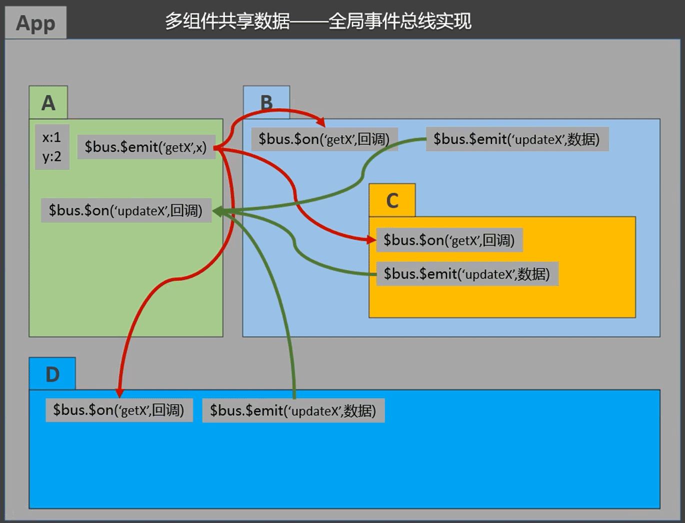
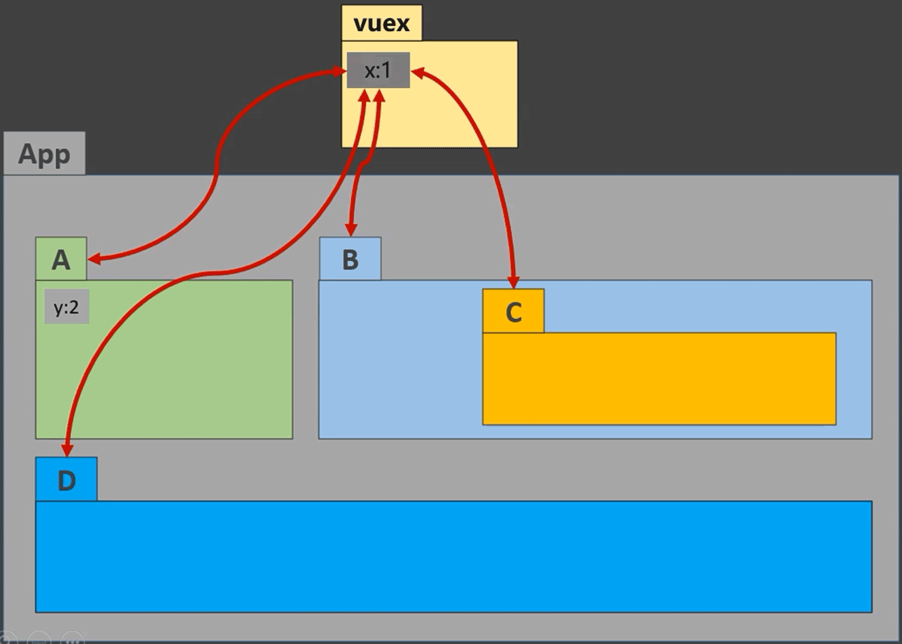

# vuex

## 1. 介绍

在 Vu e中实现集中式状态（数据）管理的一个 Vue 插件，对 vue 应用中多个组件的共享状态进行集中式的管理（读/写），也是一种组件间通信的方式，且适用于任意组件间通信。

## 2. 与全局事件总线的对比

全局事件总线（多组件共享数据）：

vuex（多组件共享数据）：

## 3. 何时使用？

多个组件需要共享数据时：

* 多个组件需要读取同一个数据
* 多个组件需要修改同一个数据