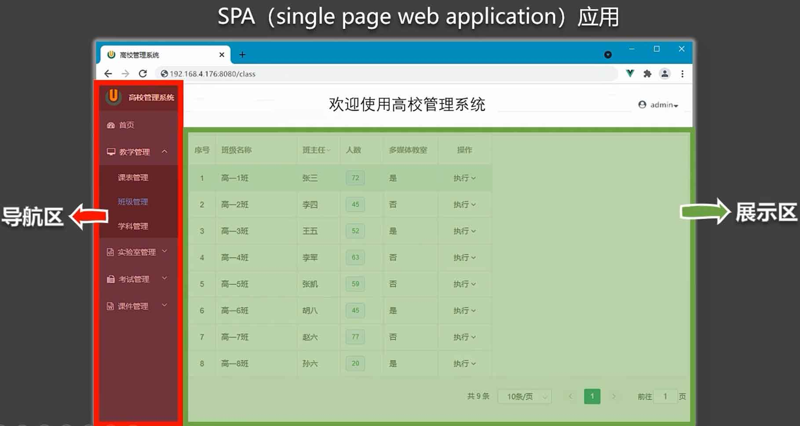
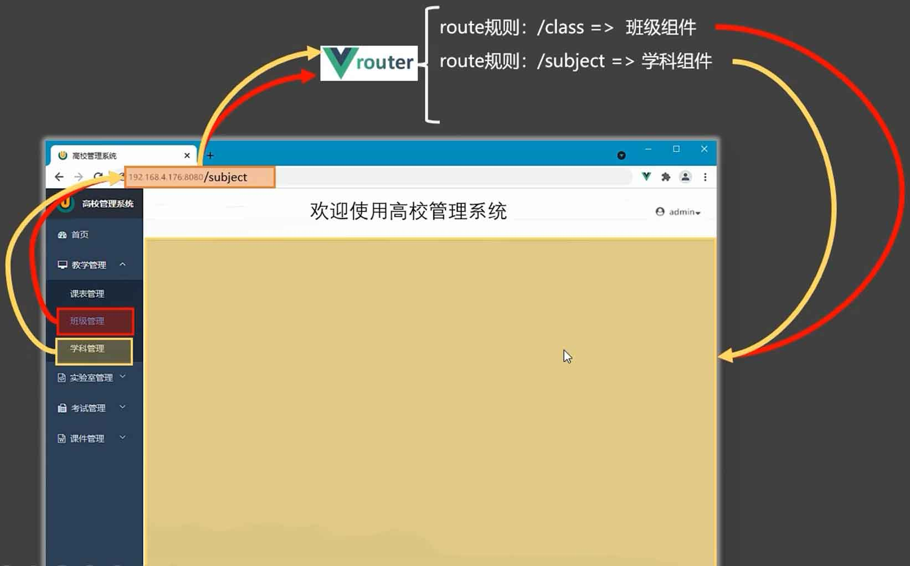

# vue-router

[[toc]]

## 1. 介绍

类比家用路由器:（生活中的路由器是为了满足多台设备上网）


SPA:



前端路由工作流程:（前端里的路由是为了完成展示区的不停切换）



## 2. 相关理解

### 2.1. vue-router 的理解

vue 的一个插件库，专门用来实现 SPA 应用

### 2.2. 对 SPA 应用的理解

1. 单页 Web 应用（single page web application，SPA）。
2. 整个应用只有一个完整的页面。
3. 点击页面中的导航链接不会刷新页面，只会做页面的局部更新。
4. 数据需要通过 ajax 请求获取。

### 2.3. 路由的理解

什么是路由?

* 一个路由就是一组映射关系（key - value）
* key 为路径, value 可能是 function 或 component

路由分类：

* 后端路由：
    * 理解：value 是 function, 用于处理客户端提交的请求。
    * 工作过程：服务器接收到一个请求时, 根据请求路径找到匹配的函数来处理请求, 返回响应数据。
* 前端路由：
    * 理解：value 是 component，用于展示页面内容。
    * 工作过程：当浏览器的路径改变时, 对应的组件就会显示。

## 3. 基本使用

vue2.x 使用 vue-router3.x

1. 安装 vue-router，命令：```npm i vue-router```

2. 应用插件：```Vue.use(VueRouter)```

3. 编写 router 配置项:

   ```javascript
   // 引入 VueRouter
   import VueRouter from 'vue-router'
   // 引入路由组件
   import About from '../components/About'
   import Home from '../components/Home'
   
   // 创建 router 实例对象，去管理一组一组的路由规则
    const router = new VueRouter({
        routes:[
            {
                path:'/about',
                component:About
            },
            {
                path:'/home',
                component:Home
            }
        ]
    })
   
   //暴露router
   export default router
   ```

4. 实现切换（ `active-class` 可配置当前路由对应 router-link 元素的高亮样式）

   ```vue
   <router-link active-class="active" to="/about">About</router-link>
   ```

5. 指定展示位置

   ```vue
   <router-view></router-view>
   ```

## 4. 几个注意点

路由组件通常存放在```pages```文件夹，一般组件通常存放在```components```文件夹。

```text
root/
components/     # 存放一般组件
  Banner.vue
pages/          # 存放路由组件
  Home.vue
  About.vue
```

通过切换，“隐藏”了的路由组件，默认是被销毁掉的，需要的时候再去挂载。

每个组件都有自己的```$route```属性，里面存储着自己的路由信息。

整个应用只有一个 router，可以通过组件的```$router```属性获取到。

## 5. 多级路由（多级路由）

配置路由规则，使用 `children` 配置项：

```javascript
routes:[
  {
    path:'/about',
    component: About,
  },
  {
    path:'/home',
    component: Home,
    children:[ // 通过 children 配置子级路由
      {
        path:'news', // 此处一定不要写：/news
        component: News
      },
      {
        path:'message',
        component: Message
      }
    ]
  }
]
```

跳转（要写完整路径）：

```vue
<router-link to="/home/news">News</router-link>
```

## 6. 命名路由

作用：1. 可以简化路由的编写；2. params 传参时，必须使用 name。 

示例：

```html
<script>
  routes = [
    { 
      path: '/a', 
      children: [ 
        { 
          path: 'b', 
          children: [
            {
              path: 'c', 
              children: [
                {
                  name: 'x'
                  path: 'd', // /a/b/c/d
                }
              ] 
            }
          ] 
        }
      ] 
    }
  ]
</script>

<router-link to="/a/b/c/d"></router-link>
<router-link :to="{ path: '/a/b/c/d' }"></router-link>
<router-link :to="{ name: 'x' }"></router-link>
```

## 7. 路由 query 传参

传递参数:

```html
<!-- to 的字符串写法 -->
<router-link :to="`/detail?id=${id}&name=${name}`">
  详情页
</router-link>

<!-- to 的对象写法 -->
<router-link
  :to="{
    path: '/detail',
    query: { id: 2, name: '李四' }
  }"
>
  详情页
</router-link>
```

接收参数：

```javascript
$route.query.id
$route.query.name
```

## 8. 路由 params 传参

路由配置：

```javascript
routes: [
  {
    name: 'detail',
    path: '/detail/:id/:name',
    component: PersonDetail,
  },
],
```

传递参数:

```html
<!-- to 的字符串写法 -->
<router-link :to="`/detail/${id}/${name}`">
  详情页
</router-link>

<!-- to 的对象写法，必须使用 name，不能使用 path -->
<router-link
  :to="{
    name: 'detail',
    params: { id: 3, name: '王五' }
  }"
>
  详情页
</router-link>
```

接收参数：

```javascript
$route.params.id
$route.params.name
```

## 9. 路由的 props 配置

作用：让路由组件更方便的收到参数

路由：

```javascript
routes = [
  // 对象写法，硬编码
  {
    path: '/props-detail-obj',
    component: PropsDetail,
    props: { id: 6, name: '赵六' },
  },

  // 布尔写法，针对路由 params 传参
  {
    path: '/props-detail-true/:id/:name',
    component: PropsDetail,
    props: true,
  },

  // 函数写法，自己操作 $route
  {
    path: '/props-detail-fun',
    component: PropsDetail,
    props($route) {
      return { ...$route.query };
    },
  },
]
```

跳转：

```html
<router-link :to="`/props-detail-obj`">
  详情页
</router-link>
<router-link :to="`/props-detail-true/7/钱七`">
  详情页
</router-link>
<router-link :to="`/props-detail-fun?id=8&name=孙八`">
  详情页
</router-link>
```

使用：

```vue
<template>
  <div>{{ id }} - {{ name }}</div>
</template>
<script>
export default {
  props: ['id', 'name'],
};
</script>
```

## 10. router-link 的 replace 属性

作用：控制路由跳转时操作浏览器历史记录的模式

浏览器的历史记录有两种写入方式：

* ```push```: 追加历史记录（默认）
* ```replace```: 替换当前记录（把后退的那条记录给替换掉了）

开启```replace```模式：

```html
<router-link replace .......>News</router-link>
```

## 11. 编程式路由导航

::: v-pre
作用：不借助 ```<router-link>``` 实现路由跳转，让路由跳转更加灵活
:::

具体编码：

```javascript
// 跳转，并追加历史记录
this.$router.push({
  path: '/detail',
  query: {
    id: xxx,
    title: xxx
  }
})

// 跳转，并替换当前历史记录
this.$router.replace({
  name:'detail',
  params:{
    id: xxx,
    title: xxx
  }
})

// 前进
this.$router.forward() 

// 后退
this.$router.back() 

// 可前进也可后退，
// num 为 正数，前进几步
// num 为 负数，后退几步
this.$router.go(num) 
```

## 12. 缓存路由组件

作用：让不展示的路由组件保持挂载，不被销毁。

具体编码：

```html
<keep-alive include="News"> 
    <router-view></router-view>
</keep-alive>
```

应用：

```html

<keep-alive>
  <router-view v-if="$route.meta.keepAlive"></router-view>
</keep-alive>
<router-view v-if="!$route.meta.keepAlive"></router-view>

<script>
  routes = [
    // 通过 meta.keepAlive 设置是否缓存该路由组件
    { path: '/person', meta: { keepAlive: false }, component: Person },
    { path: '/school', meta: { keepAlive: true }, component: School },
  ]
</script>
```

参考：

* [vue中动态化的按需使用keep-alive](https://cloud.tencent.com/developer/article/2211709)