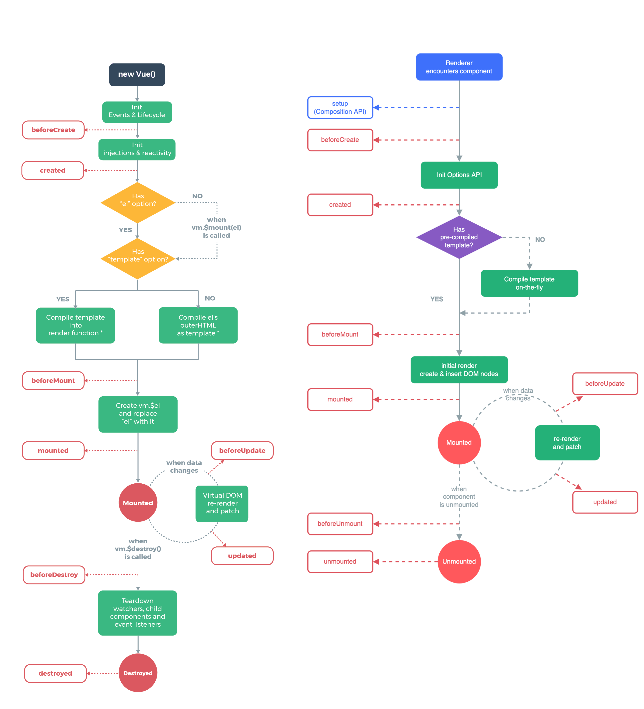

# Vue3 快速上手


## 1. Vue3 简介

2020年9月18日，Vue.js 发布 [3.0 版本](https://github.com/vuejs/core/releases/tag/v3.0.0)，代号：One Piece（海贼王）

## 2. Vue3 带来了什么

### 2.1. 性能的提升

- 打包大小减少 41%
- 初次渲染快 55%, 更新渲染快 133%
- 内存减少 54%
- ......

### 2.2. 源码的升级

- 使用 Proxy 代替 defineProperty 实现响应式
- 重写虚拟DOM的实现和 Tree-Shaking
- ......

### 2.3. 拥抱TypeScript

Vue3 可以更好的支持 TypeScript

### 2.4. 新的特性

1. Composition API（组合API）
   - setup 配置
   - ref 与 reactive
   - watch 与 watchEffect
   - provide 与 inject
   - ......

2. 新的内置组件
   - Fragment 
   - Teleport
   - Suspense

3. 其他改变
   - 新的生命周期钩子
   - data 选项应始终被声明为一个函数
   - keyCode 不能再作为 v-on 的修饰符
   - ......

## 3. 创建 Vue3 工程

### 3.1. 使用 vue-cli 创建

官方文档：[https://cli.vuejs.org/zh/guide/creating-a-project.html](https://cli.vuejs.org/zh/guide/creating-a-project.html)

```bash
## 查看 @vue/cli 版本，确保 @vue/cli 版本在 4.5.0 以上
vue --version

## 安装或者升级你的 @vue/cli
npm install -g @vue/cli

## 创建
vue create vue3-proj-by-cli

# Vue CLI v5.0.8
# ? Please pick a preset:
# > Default ([Vue 3] babel, eslint) 
#   Default ([Vue 2] babel, eslint) 
#   Manually select features 


## 切换目录
cd vue3-proj-by-cli

## 启动
npm run serve
```

### 3.2. 使用 vite 创建

vite官网：[https://vitejs.cn](https://vitejs.cn)

什么是 vite？—— 新一代前端构建工具。

优势如下：
- 开发环境中，无需打包操作，可快速的冷启动。
- 轻量快速的热重载（HMR）。
- 真正的按需编译，不再等待整个应用编译完成。

传统构建 与 vite 构建对比图：

* 

* 

创建项目：

```bash
# node 16+
npm create vite@latest

# Need to install the following packages:
#   create-vite@latest
# Ok to proceed? (y) y
# √ Project name: ... vue3-proj-by-vite
# √ Select a framework: » Vue
# √ Select a variant: » JavaScript

# Done. Now run:

#   cd vue3-proj-by-vite
#   npm install
#   npm run dev
```

## 4. 分析工程结构

main.js:

```javascript
// 引入的不再是 Vue 构造函数了，引入的是一个名为 createApp 的工厂函数
import { createApp } from 'vue'
import App from './App.vue'

// 创建应用实例对象 —— app (类似于之前 Vue2 中的 vm，但 app 比 vm 更“轻”)
const app = createApp(App)

// 挂载
app.mount('#app')
```

App.vue:

```html
<template>
	<!-- Vue3 组件中的模板结构可以没有根标签 -->
	
	<HelloWorld msg="Welcome to Your Vue.js App"/>
</template>
```

## 5. 常用 Composition API

### 5.1. setup

setup 是 Vue3 中一个新的配置项，值为一个函数。

setup 是所有 Composition API（组合API） “表演的舞台”。

组件中所用到的：数据、方法等等，均要配置在 setup 中。

setup 函数有两种返回值：

1. 对象，则对象中的属性、方法, 在模板中均可以直接使用。
2. 渲染函数：则可以自定义渲染内容。（类似 vue2 中的 render 选项）

注意点：

1. 尽量不要与 Vue2 配置混用
   - Vue2 配置（data、methods、computed...）中可以访问到 setup 中的属性、方法。
   - setup 中访问不到 Vue2 配置（data、methods、computed...）。
   - 如果有重名, setup 优先。
2. setup 不能是一个 async 函数，因为返回值不再是 return 的对象, 而是 promise, 模板看不到 return 对象中的属性。（后期也可以返回一个 Promise 实例，但需要 Suspense 和异步组件的配合）

示例：

```html
<template>
  <p>姓名：{{ name }}</p>
  <p>年龄：{{ age }}</p>
  <p><button @click="sayHello">sayHello</button></p>
</template>

<script>
export default {
  name: 'App',
  setup() {
    const name = '张三';
    const age = 18;

    function sayHello() {
      alert(`你好，我是${name}，今年${age}岁。`);
    }

    return {
      name,
      age,
      sayHello,
    }
  }
}
</script>
```

### 5.2. ref 函数

作用: 定义一个响应式的数据

语法: 

```javascript
import { ref } from 'vue';

// RefImpl 是 Ref 的实现
// varName 是 RefImpl 的实例，称 varName 为引用对象（reference对象，简称ref对象）
// RefImp { value, ..., }
const varName = ref(initValue)
```

在 JS 中读写数据：

```javascript
// 基本类型数据
const name = ref('张三');

// 对象类型数据
const person = ref({ name: '李四', age: 18 });

// 通过 defineProperty 的 get 获取到 name 的值
console.log( name.value );

// Proxy { name, age }，内部使用了 reactive 函数
console.log (person.value );
```

在 模板 中读取数据：

```html
<template>
  <!-- 不需要加 .value -->
  <div>{{ name }}</div>
  <div>{{ person.name }}</div>
</template>
```

响应式数据：

- 基本类型的数据：响应式依然是靠 `Object.defineProperty()` 的 `get` 与 `set` 完成的。
- 对象类型的数据：内部“求助”了 Vue3 中的一个新函数 —— `reactive` 函数。

示例：

```html
<template>
  <p>姓名：{{ name }}</p>
  <p>年龄：{{ age }}</p>

  <p>{{ person.name }} - {{ person.age }}</p>
  
  <p><button @click="change">change</button></p>
</template>
<script>
import { ref } from 'vue';

export default {
  setup() {
    const name = ref('张三');
    const age = ref(18);
    const person = ref({ name: '李四', age: 19 })

    function change() {
      name.value = '张三2';
      age.value = 28;

      person.value.name = '李四2';
      person.value.age = 29;
    }

    return { name, age, person, change };
  }
}
</script>
```

### 5.3. reactive 函数

作用: 定义一个对象类型的响应式数据（基本类型不要用它，要用 `ref` 函数）

语法：

```javascript
// 接收一个对象（或数组），
// 返回一个代理对象（Proxy的实例对象，简称proxy对象）
const 代理对象 = reactive(源对象)
```

说明：

- reactive 定义的响应式数据是“深层次的”。
- 可直接通过 index 修改数组的元素
- 内部基于 ES6 的 Proxy 实现，通过代理对象操作源对象内部数据进行操作。

示例：

```html
<template>
  <p>姓名：{{ person.name }}</p>
  <p>年龄：{{ person.age }}</p>
  <p>爱好：{{ hobby }}</p>

  <p><button @click="change">change</button></p>
</template>

<script>
import { reactive } from 'vue';

export default {
  setup() {
    const person = reactive({
      name: '张三',
      age: 18,
    });

    // 可直接通过 index 修改数组的元素
    const hobby = reactive([ '踢球', '打篮球', '打乒乓球' ]);

    function change() {
      person.name = '李四';
      person.age = 28;

      hobby[1] = '学习';
    }

    return { person, hobby, change };
  }
}
</script>
```

### 5.4. vue2 与 vue3 响应式原理

#### 5.4.1. vue2 的响应式

对象类型：

* 通过 `Object.defineProperty()` 对 属性的读取、修改 进行拦截（数据劫持）。

  ```javascript
  Object.defineProperty(data, 'count', {
    get () {}, 
    set () {},
  })
  ```
  
数组类型：

* 通过重写更新数组的一系列方法来实现拦截。（对数组的变更方法进行了包裹）。

存在问题：

* `defineProperty` 只能劫持到对已有属性的修改；直接新增属性、直接删除属性，界面不会更新
* 直接通过下标修改数组, 界面不会自动更新

  ```javascript
  data = {
    person: { name: '张三', age: 18 },
    nums: [ 1, 2, 3]
  };

  // 新增/修改 属性
  this.$set(this.person, 'gender', '李四');

  // 删除 属性
  this.$delete(this.person, 'name');

  // 修改数组元素
  this.$set(this.nums, 1, 100); // 将 index 为 1 的元素改为 100
  this.nums.splice(1, 1, 100);  // 将 index 为 1 的元素删掉，再插入 100
  ```

模拟实现：

```javascript
const data = {
  name: '张三',
};

const $data = {};

Object.defineProperty($data, 'name', {
  configurable: true, // 让 name 属性可删除
  get() {
    return data.name;
  },
  set(value) {
    console.log('name 被更改，去更新界面了')
    data.name = value;
  }
});

// 修改已有属性，可以监测到
$data.name = '李四';

// 添加新属性，监测不到
$data.age = 18;

// 删除已有属性，监测不到
delete $data.name;
```

#### 5.4.2. vue3 的响应式

实现原理: 

* 通过 Proxy（代理）: 拦截对象中任意属性的变化（属性值的读写、属性的添加、属性的删除）
* 通过 Reflect（反射）: 对源对象的属性进行操作。

MDN 文档：

* [Proxy](https://developer.mozilla.org/zh-CN/docs/Web/JavaScript/Reference/Global_Objects/Proxy)
* [Reflect](https://developer.mozilla.org/zh-CN/docs/Web/JavaScript/Reference/Global_Objects/Reflect)

模拟实现：

```javascript
const data = {
  name: '张三',
};

const proxy = new Proxy(data, {
  get(target, propName) {
    console.log('读 属性:', propName);

    // return target[propName];
    return Reflect.get(target, propName);
  },
  set(target, propName, value) {
    if (target.hasOwnProperty(propName)) {
      console.log('改 属性:', propName);
    } else {
      console.log('增 属性:', propName);
    }

    // target[propName] = value;
    Reflect.set(target, propName, value);
  },
  deleteProperty(target, propName) {
    console.log('删 属性:', propName);

    // return delete target[propName];
    return Reflect.defineProperty(target, propName);
  }
});

proxy.name;           // 读 属性: name

proxy.name = '李四';  // 改 属性: name

proxy.age = 18;       // 增 属性: age

delete proxy.age;     // 删 属性: age
```

### 5.5. ref vs reactive

| 对比 | ref | reactive |
| - | - | - |
| 定义数据 | 基本类型数据 | 对象（或数组）类型数据 |
| 原理 | `Object.defineProperty()` 的 get/set 进行数据劫持 | Proxy 数据劫持；Reflect 修改源对象 |
| 使用 | JS中需要加`.value`，模板中不需要 | JS、模板中都不需要 `.value` |

备注：

* ref 也可以用来定义对象（或数组）类型数据，它内部会自动通过 `reactive` 转为 Proxy 实例对象

### 5.6. setup 的两个注意点

setup 执行的时机:

* 在 beforeCreate 之前执行 且只执行一次，this 是 undefined 。

vue2 中的 $attrs 和 $slots:

* $attrs: 用于接收未被 props 选项声明的属性，捡漏的
* $slots: 存放父组件往当前组件里分发的 vNode，如 `$slots: { default: [ vNode, ... ] }`

setup 的参数:
- props：值为对象，组件外部传递过来 且 组件内部声明接收了的属性。
- context：上下文对象
  - attrs: 值为对象，组件外部传递过来 但 没有在 props 配置中声明的属性, 相当于 `this.$attrs`。
  - slots: 收到的插槽内容, 相当于 `this.$slots`, 要使用 `v-slot:default` 写法。
  - emit: 分发自定义事件的函数, 相当于 `this.$emit`。

示例：

* App.vue

  ```html
  <template>
    <Demo name="张三" :age="18" gender="男" @show="handleShow" >
      <template #default><span>xxx</span></template>
    </Demo>
  </template>

  <script>
  import Demo from './Demo.vue';

  export default {
    name: 'App',
    components: { Demo },
    setup() {
      function handleShow(value) {
        alert(`handleShow(${value})`);
      }

      return { handleShow }
    }
  }
  </script>
  ```

* Demo.vue

  ```html
  <template>
    <p>{{ name }} - {{ age }}</p>
    <button @click="handleClick">show</button>
  </template>

  <script>
  export default {
    name: 'Demo',
    props: [ 'name', 'age', /* 'gender' */ ],
    emits: [ 'show' ],
    setup(props, context) {
      // Proxy(Object) {name: '张三', age: 18}
      console.log('props:', props); 

      // Proxy(Object) {gender: '男'}
      console.log('context.attrs:', context.attrs);

      // Proxy(Object) {default: ƒ}
      console.log('context.slots:', context.slots);

      function handleClick() {
        context.emit('show', 666);
      }

      return { handleClick };
    }
  }
  </script>
  ```

### 5.7. computed 函数

与 Vue2 中 computed 配置功能一致

示例：

```html
<template>
  <p>姓：<input type="text" v-model="person.firstName"></p>
  <p>姓: <input type="text" v-model="person.lastName"></p>
  <p>姓名：{{ person.fullName }}</p>
  <p>姓名：<input type="text" v-model="person.editableFullName"></p>
</template>
<script>
import { reactive, computed } from 'vue';
export default {
  setup() {
    const person = reactive({
      firstName: '张',
      lastName: '三',
    });

    // 简写，只读
    person.fullName = computed(() => {
      return person.firstName + '-' + person.lastName;
    });

    // 完整，读写
    person.editableFullName = computed({
      get() {
        return person.firstName + '-' + person.lastName;
      },
      set(value) {
        ([ person.firstName, person.lastName ] = value.split('-'));
      }
    });

    return { person };
  }
}
</script>
```

### 5.8. watch 函数

与 Vue2 中 watch 配置功能一致

两个小“坑”：

- 监视 reactive 定义的响应式数据时：oldValue 无法正确获取、强制开启了深度监视（deep配置失效）。
- 监视 reactive 定义的响应式数据中某个属性时：deep 配置有效。

示例：

```html
<!--vue3-proj-by-cli/src-06-watch/App.vue-->
<template>
  <p>numOne: <span>{{ numOne }}</span> <button @click="numOne++">+</button></p>
  <p>numTwo: <span>{{ numTwo }}</span> <button @click="numTwo++">+</button></p>
  <hr>
  <p>人的年龄：{{ person.age }} <button @click="person.age++">+</button></p>
  <hr>
  <p>狗的年龄：{{ dog.age }} <button @click="dog.age++">+</button></p>
  <p>狗的类别：{{ dog.category.a.b.c }} <button @click="dog.category.a.b.c++">+</button></p>
</template>

<script>
import { reactive, ref, watch } from 'vue';
export default {
  setup() {
    const numOne = ref(0);
    const numTwo = ref(1);

    // 监视 ref 对象(基本类型)，监视的是 RefImpl{ value, ... }，可以监测到 ref 对象的 value 变化
    watch(
      numOne, 
      (newValue, oldValue) => {
        console.log('numOne', newValue, oldValue);
      },
      { immediate: false, deep: false },
    );

    // 监视多个 ref 对象(基本类型)
    watch(
      [numOne, numTwo], 

      // newValues: [ numOne新值, numTwo新值 ]
      // oldValues: [ numOne旧值, numTwo旧值 ]
      (newValues, oldValues) => {
        console.log('numOne & numTwo', newValues, oldValues);
      },
      { immediate: true, deep: false },
    );


    const person = ref({ age: 18 });

    // 监视 ref 对象（对象类型）
    watch(
      person, 
      (newValue, oldValue) => { 
        console.log('person', newValue, oldValue);
      },
      { deep: true },
    );


    // 监视 ref 对象包裹的对象（Proxy 对象，由 reactive 函数生成，也就说是 reactive 对象）
    watch(
      person.value, 
      (newValue, oldValue) => { 
        console.log('person.value', newValue, oldValue);
      },
    );

    const dog = reactive({
      age: 1,
      category: {
        a: {
          b: { 
            c: 1
          }
        }
      }
    });

    // 监视 reactive 对象
    watch(
      dog,
      // oldValue 无效，其值与 newValue 一样
      (newValue, oldValue) => {
        console.log('dog', newValue, oldValue);
      }
      // 强制开启 deep，且无法关闭
    );

    // 监视 reactive 对象的属性，此属性的值是基本类型
    watch(
      () => dog.age,
      (newValue, oldValue) => {
        console.log('dog.age', newValue, oldValue);
      }
    );

    // 监视 reactive 对象的属性，此属性的值是对象类型
    watch(
      () => dog.category,
      (newValue, oldValue) => {
        console.log('dog.category', newValue, oldValue);
      },
      // 必须开启 deep
      { deep: true },
    );


    return { numOne, numTwo, person, dog }
  }
}
</script>
```

### 5.9. watchEffect 函数

watch 的套路是：既要指明监视的属性，也要指明监视的回调。

watchEffect 的套路是：不用指明监视哪个属性，监视的回调中用到哪个属性，那就监视哪个属性。

watchEffect 有点像 computed：

- 但 computed 注重的计算出来的值（回调函数的返回值），所以必须要写返回值。
- 而 watchEffect 更注重的是过程（回调函数的函数体），所以不用写返回值。

示例:

```html
<!--vue3-proj-by-cli/src-07-watchEffect/App.vue-->
<template>
  <p>numOne: <span>{{ numOne }}</span> <button @click="numOne++">+</button></p>
  <p>numTwo: <span>{{ numTwo }}</span> <button @click="numTwo++">+</button></p>
  <hr>
  <p>人的年龄：{{ person.age }} <button @click="person.age++">+</button></p>
  <hr>
  <p>狗的年龄：{{ dog.age }} <button @click="dog.age++">+</button></p>
  <p>狗的类别：{{ dog.category.a.b.c }} <button @click="dog.category.a.b.c++">+</button></p>
</template>

<script>
import { reactive, ref, watchEffect } from 'vue';
export default {
  setup() {
    const numOne = ref(0);
    const numTwo = ref(1);

    const person = ref({ age: 18 });

    const dog = reactive({
      age: 1,
      category: {
        a: {
          b: { 
            c: 1
          }
        }
      }
    });

    // 一上来就执行一次，用到那个属性一旦变化就重新执行函数体
    watchEffect(() => {
      console.log('numOne', numOne.value);
    });


    watchEffect(() => {
      console.log('numOne & numTwo', numOne.value, numTwo.value);
    });

    watchEffect(() => {
      console.log('person.value.age', person.value.age);
    });

    watchEffect(() => {
      console.log('dog.age', dog.age);
    });
    
    watchEffect(() => {
      console.log('dog.category.a.b.c', dog.category.a.b.c);
    });

    return { numOne, numTwo, person, dog }
  }
}
</script>
```

### 5.10. 生命周期

图示：



对比图：

| vue2 钩子配置项 | vue3 钩子配置项 | vue3 组合式API |
| - | - | - |
| beforeCreate | beforeCreate | **setup()** |
| created | created | **setup()** |
| beforeMount | beforeMount | onBeforeMount() |
| mounted | mounted | onMounted() |
| beforeUpdate | beforeUpdate | onBeforeUpdate() |
| updated | updated | onUpdated() |
| **beforeDestroy** | **beforeUnmount** | onBeforeUnmount() |
| **destroyed** | **unmounted** | onUnmounted() |

注意：

* vue3 中可以继续使用 vue2 中的生命周期钩子，但有有两个被更名：
  - ```beforeDestroy``` 改名为 ```beforeUnmount```
  - ```destroyed``` 改名为  ```unmounted```
* vue3 中的组合式钩子函数比配置项先执行

### 5.11. 自定义 hook 函数

什么是 hook ？—— 本质是一个函数，把 setup 函数中使用的 Composition API 进行了封装 。

类似于 vue2 中的 mixin 。

自定义 hook 的优势: 复用代码, 让 setup 中的逻辑更清楚易懂 。

#### 5.11.1. 示例

目录结构：

```text
proj/
  src/
    hooks/
      usePoint.js
    App.vue
```

App.vue:

<<< @/codes/frontend/vue3/guide/vue3-proj-by-cli/src-08-hooks/App.vue

usePoint.js:

<<< @/codes/frontend/vue3/guide/vue3-proj-by-cli/src-08-hooks/hooks/usePoint.js

### 5.12. toRef & toRefs

#### 5.12.1. toRef

作用：创建一个 ref 对象，其 value 值指向另一个对象中的某个属性。

应用: 要将响应式对象中的某个属性单独提供给外部使用时。

语法：

```javascript
const person = reactive({ name: 'zs', age: 18 });

// ObjectRefImpl { ..., value }, value 指向 student.name
const name = toRef(student, 'name');
```

示例：

<<< @/codes/frontend/vue3/guide/vue3-proj-by-cli/src-09-ref/ToRefTest.vue


#### 5.12.2. toRefs

作用：将对象的第一层属性转为 ref 对象

语法：

```javascript
// {name: ObjectRefImpl, age: ObjectRefImpl}
const studentRefs = toRefs(student);
```

示例：

<<< @/codes/frontend/vue3/guide/vue3-proj-by-cli/src-09-ref/ToRefsTest.vue

## 6. 其它 Composition API

### 6.1. shallowReactive 与 shallowRef

shallowReactive: 只处理对象最外层属性的响应式（浅响应式）。

shallowRef: 只处理基本数据类型的响应式, 不进行对象的响应式处理。

示例：

```javascript
import {shallowReactive, shallowRef} from 'vue';

setup() {
  // person.school.name 不是响应式的
  const person = shallowReactive({
    name: '张三',
    age: 18,
    school: { name: '第一中学' }
  });

  // student.name 不是响应式的
  const student = shallowRef({ name: 'zs' });
}
```

### 6.2. readonly 与 shallowReadonly

readonly: 让一个响应式数据变为只读的（深只读）。

shallowReadonly：让一个响应式数据变为只读的（浅只读）。

应用场景: 不希望数据被修改时。比如别的组件传过来的数据，你可以使用 readonly 将其保护起来，避免无意间被修改。

示例：

```javascript
import { reactive, ref, readonly, shallowReadonly } from 'vue';

setup() {
  const num = ref(0);
  const person = reactive({
    name: '张三',
    school: { name: '第一中学' }
  });

  // 所有属性都不允许修改
  const readonlyPerson = readonly(person);

  // 第一层属性不允许修改，
  // shallowReadonlyPerson.school       不能修改
  // shallowReadonlyPerson.school.name  可以修改
  const shallowReadonlyPerson = shallowReadonly(person);

  // 都不允许修改
  const readonlyNum = readonly(num);
  const shallowReadonlyNum = shallowReadonly(num);
}
```

### 6.3. toRaw 与 markRaw

#### 6.3.1. toRaw

作用：将一个由 `reactive` 生成的响应式对象转为普通对象。

使用场景：用于读取响应式对象对应的普通对象，对这个普通对象的所有操作，不会引起页面更新。

示例：

```javascript
import { reactive, toRaw } from 'vue';

setup() {
  // 原始数据
  const data = {
    loginName: 'root',
    password: '123456',
  };

  // 将原始数据变为响应式数据
  const reactiveData = reactive(data); // Proxy {...}

  // 将响应式数据变为原始数据
  const originData = toRaw(reactiveData); // {...}
}
```

#### 6.3.2. markRaw

作用：标记一个对象，使其永远不会再成为响应式对象。

应用场景:

1. 有些值不应被设置为响应式的，例如复杂的第三方类库等。
2. 当渲染具有不可变数据源的大列表时，跳过响应式转换可以提高性能。

示例：

```javascript
import { reactive, markRaw } from 'vue';

setup() {
  const person = reactive({ name: '张三' });

  // 无论怎么修改 person.car 的属性都不会引起页面更新
  person.car = markRaw({ name: '比亚迪', price: 15 });
}
```

### 6.4. customRef

作用：创建一个自定义的 ref，并对其**依赖项跟踪**和**更新触发**进行显式控制。

实现防抖效果：

<<< @/codes/frontend/vue3/guide/vue3-proj-by-cli/src-10-customRef/App.vue

### 6.5. provide 与 inject

图示：


作用：实现 祖与后代 组件间通信

套路：祖组件有一个 `provide` 选项来提供数据，后代组件有一个 `inject` 选项来使用这些数据

写法：

1. 祖组件中：

    ```javascript
    setup(){
      let car = reactive({ name:'奔驰', price:'40万' });
      // 提供数据
      provide('car',car);
      // ...
    }
    ```

2. 后代组件中：

    ```javascript
    setup(props,context){
      // 使用数据
      const car = inject('car');
      // ...
    }
    ```

### 6.6. 响应式数据的判断

```javascript
import { 
  ref, 
  reactive, 
  readonly, 

  isRef,      // 是否为一个 ref 对象
  isReactive, // 是否是由 `reactive` 创建的响应式代理
  isReadonly, // 是否是由 `readonly` 创建的只读代理
  isProxy     // 是否是由 `reactive` 或者 `readonly` 方法创建的代理
} from 'vue';

export default {
  setup() {
    const numRef = ref(0);
    const personReactive = reactive({});
    const personReadonly = readonly(personReactive)
    
    console.log(isRef(numRef)); // true
    console.log(isReactive(personReactive)) // true
    console.log(isReadonly(personReadonly)) // true
    console.log(isProxy(personReactive)) // true
  }
}
```

## 7. Composition API 的优势

### 7.1. Options API 存在的问题

使用传统 Options API 中，新增或者修改一个需求，就需要分别在 data，methods，computed 里修改 。


### 7.2. Composition API 的优势

我们可以更加优雅的组织我们的代码，函数。让相关功能的代码更加有序的组织在一起。


## 8. 新的组件

### 8.1. fragment

在 vue2 中，组件必须有一个根标签

在 vue3 中，组件可以没有根标签，内部会将多个标签包含在一个 `<fragment>` 虚拟元素中

好处: 减少标签层级, 减小内存占用

### 8.2. teleport (移动)

作用：`<teleport>` 将包裹的 HTML 元素移动到（append）指定位置

props:

```typescript
interface TeleportProps {
  /**
   * 必填项。指定目标容器。
   * 可以是选择器或实际元素。
   */
  to: string | HTMLElement
  /**
   * 当值为 `true` 时，内容将保留在其原始位置
   * 而不是移动到目标容器中。
   * 可以动态更改。
   */
  disabled?: boolean
}
```

示例：

```html
<teleport to="body">
  <!-- append dialog to body -->
  <div class="dialog">
    <h3>我是一个弹窗</h3>
  </div>
</teleport>
```

### 8.3. suspense

作用：等待异步组件时渲染一些额外内容，让应用有更好的用户体验

Demo.vue：（setup 是异步）

```html
<template>
  <div>我是 Demo 组件</div>
</template>
<script>
export default {
  setup() {
    const res = {};
    return new Promise((resolve, reject) => {
      setTimeout(() => {
        resolve(res);
      }, 2000);
    });
  }
}
</script>
```

App.vue:

```html
<template>
  <div class="app">
    我是 App 组件
    <suspense>
      <template #default>
        <Demo />
      </template>
      <!-- 后备内容 -->
      <template #fallback>
        <div>
          loading demo......
        </div>
      </template>
    </suspense>
  </div>
</template>
<script>
import { defineAsyncComponent } from 'vue';

// 定义一个异步组件
const Demo = defineAsyncComponent(() => import('./Demo.vue'));

export default {
  components: { Demo },
}
</script>
```

## 9. 其他

### 9.1. 全局 API 的转移

vue2 有许多全局 API 和配置，如：

```javascript
// 1. 添加全局过滤器
Vue.filter(/* .... */)

// 2. 添加全局指令
Vue.directive(/* .... */)

// 3. 配置全局混入(合)
Vue.mixin(/* .... */)

// 4. 配置全局组件
Vue.component(/* ... */);
```

::: v-pre
vue3 中对这些API做出了调整：（将 `Vue.xxx` 转移到 `app` 上了）

| 2.x 全局 API（```Vue```） | 3.x 实例 API (`app`)                        |
| ------------------------- | ------------------------------------------- |
| Vue.config.xxxx           | app.config.xxxx                             |
| Vue.config.productionTip  | 移除                                        |
| Vue.component             | app.component                               |
| Vue.directive             | app.directive                               |
| Vue.mixin                 | app.mixin                                   |
| Vue.use                   | app.use                                     |
| Vue.prototype             | app.config.globalProperties                 |
:::

### 9.2. 其他改变

* data 选项应始终被声明为一个函数

* 过度类名的更改：

  * vue2:

    ```css
    .v-enter,
    .v-leave-to { /*  */ }

    .v-leave,
    .v-enter-to { /*  */ }
    ```
  * vue3:
  
    ```css
    .v-enter-from,
    .v-leave-to { /*  */ }

    .v-leave-from,
    .v-enter-to { /*  */ }
    ```

* 移除 keyCode 作为 v-on 的修饰符，也不再支持 `config.keyCodes`

* 移除 `v-on.native` 修饰符：

  - 父组件中绑定事件

    ```html
    <my-component
      v-on:close="handleComponentEvent"
      v-on:click="handleNativeClickEvent"
    />
    ```

  - 子组件中声明自定义事件，未声明的 `click` 就是原生事件

    ```javascript
    export default {
      emits: ['close']
    }
    ```

* 移除 过滤器（filter）
