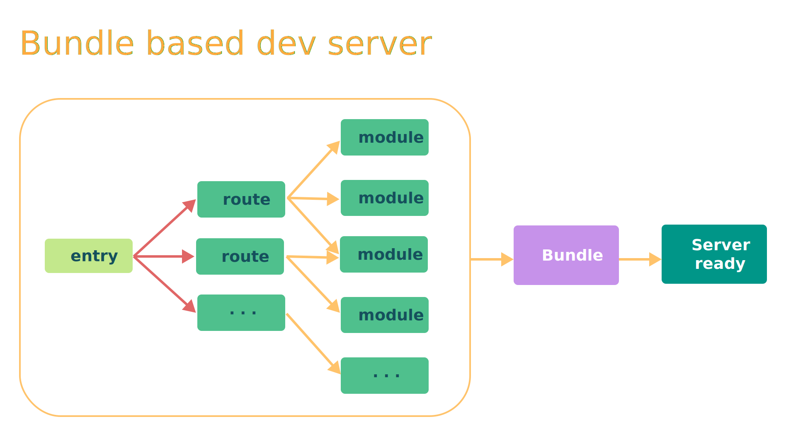
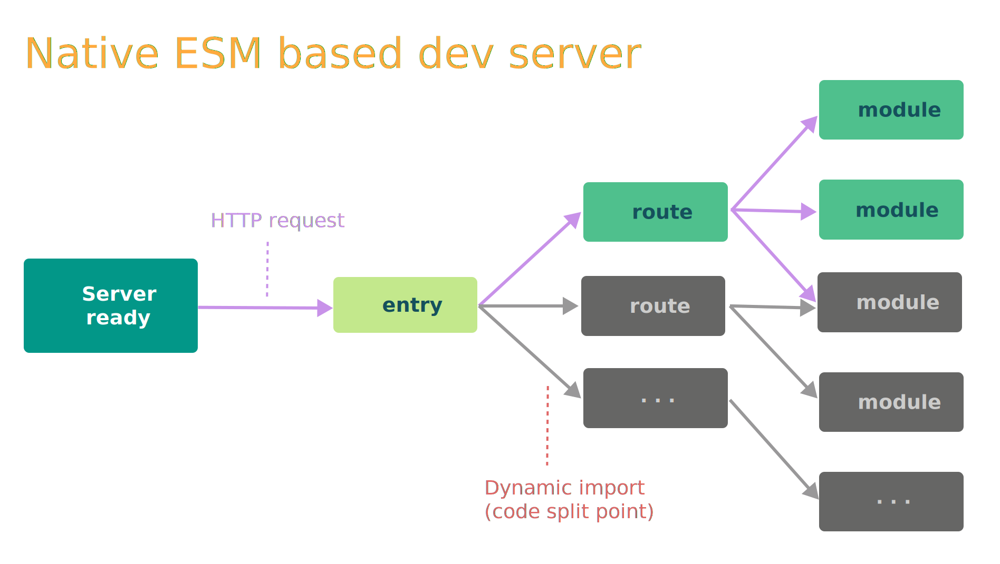

# Vue3 快速上手

[[toc]]

## 1. Vue3 简介

2020年9月18日，Vue.js 发布 [3.0 版本](https://github.com/vuejs/core/releases/tag/v3.0.0)，代号：One Piece（海贼王）

## 2. Vue3 带来了什么

### 2.1. 性能的提升

- 打包大小减少41%
- 初次渲染快55%, 更新渲染快133%
- 内存减少54%
- ......

### 2.2. 源码的升级

- 使用 Proxy 代替 defineProperty 实现响应式
- 重写虚拟DOM的实现和 Tree-Shaking
- ......

### 2.3. 拥抱TypeScript

Vue3 可以更好的支持 TypeScript

### 2.4. 新的特性

1. Composition API（组合API）
   - setup配置
   - ref与reactive
   - watch与watchEffect
   - provide与inject
   - ......

2. 新的内置组件
   - Fragment 
   - Teleport
   - Suspense

3. 其他改变
   - 新的生命周期钩子
   - data 选项应始终被声明为一个函数
   - keyCode 不能再作为 v-on 的修饰符
   - ......

## 3. 创建 Vue3 工程

### 3.1. 使用 vue-cli 创建

官方文档：[https://cli.vuejs.org/zh/guide/creating-a-project.html](https://cli.vuejs.org/zh/guide/creating-a-project.html)

```bash
## 查看 @vue/cli 版本，确保 @vue/cli 版本在 4.5.0 以上
vue --version

## 安装或者升级你的 @vue/cli
npm install -g @vue/cli

## 创建
vue create vue3-proj-by-cli

# Vue CLI v5.0.8
# ? Please pick a preset:
# > Default ([Vue 3] babel, eslint) 
#   Default ([Vue 2] babel, eslint) 
#   Manually select features 


## 切换目录
cd vue3-proj-by-cli

## 启动
npm run serve
```

### 3.2. 使用 vite 创建

vite官网：[https://vitejs.cn](https://vitejs.cn)

什么是 vite？—— 新一代前端构建工具。

优势如下：
- 开发环境中，无需打包操作，可快速的冷启动。
- 轻量快速的热重载（HMR）。
- 真正的按需编译，不再等待整个应用编译完成。

传统构建 与 vite构建对比图：

* 

* 

创建项目：

```bash
# node 16+
npm create vite@latest

# Need to install the following packages:
#   create-vite@latest
# Ok to proceed? (y) y
# √ Project name: ... vue3-proj-by-vite
# √ Select a framework: » Vue
# √ Select a variant: » JavaScript

# Done. Now run:

#   cd vue3-proj-by-vite
#   npm install
#   npm run dev
```

## 4. 分析工程结构

main.js:

```javascript
// 引入的不再是 Vue 构造函数了，引入的是一个名为 createApp 的工厂函数
import { createApp } from 'vue'
import App from './App.vue'

// 创建应用实例对象 —— app (类似于之前 Vue2 中的 vm，但 app 比 vm 更“轻”)
const app = createApp(App)

// 挂载
app.mount('#app')
```

App.vue:

```html
<template>
	<!-- Vue3 组件中的模板结构可以没有根标签 -->
	
	<HelloWorld msg="Welcome to Your Vue.js App"/>
</template>
```

## 5. 常用 Composition API

### 5.1. setup

setup 是 Vue3 中一个新的配置项，值为一个函数。

setup 是所有 Composition API（组合API） “表演的舞台”。

组件中所用到的：数据、方法等等，均要配置在 setup 中。

setup 函数有两种返回值：

1. 对象，则对象中的属性、方法, 在模板中均可以直接使用。
2. 渲染函数：则可以自定义渲染内容。（类似 vue2 中的 render 选项）

注意点：

1. 尽量不要与 Vue2 配置混用
   - Vue2 配置（data、methods、computed...）中可以访问到 setup 中的属性、方法。
   - setup 中访问不到 Vue2 配置（data、methods、computed...）。
   - 如果有重名, setup 优先。
2. setup 不能是一个 async 函数，因为返回值不再是 return 的对象, 而是 promise, 模板看不到 return 对象中的属性。（后期也可以返回一个 Promise 实例，但需要 Suspense 和异步组件的配合）

示例：

```html
<template>
  <p>姓名：{{ name }}</p>
  <p>年龄：{{ age }}</p>
  <p><button @click="sayHello">sayHello</button></p>
</template>

<script>
export default {
  name: 'App',
  setup() {
    const name = '张三';
    const age = 18;

    function sayHello() {
      alert(`你好，我是${name}，今年${age}岁。`);
    }

    return {
      name,
      age,
      sayHello,
    }
  }
}
</script>
```

### 5.2. ref 函数

作用: 定义一个响应式的数据

语法: 

```javascript
import { ref } from 'vue';

// RefImpl 是 Ref 的实现
// varName 是 RefImpl 的实例，称 varName 为引用对象（reference对象，简称ref对象）
// RefImp { value, ..., }
const varName = ref(initValue)
```

在 JS 中读写数据：

```javascript
// 基本类型数据
const name = ref('张三');

// 对象类型数据
const person = ref({ name: '李四', age: 18 });

// 通过 defineProperty 的 get 获取到 name 的值
console.log( name.value );

// Proxy { name, age }，内部使用了 reactive 函数
console.log (person.value );
```

在 模板 中读取数据：

```html
<template>
  <!-- 不需要加 .value -->
  <div>{{ name }}</div>
  <div>{{ person.name }}</div>
</template>
```

响应式数据：

- 基本类型的数据：响应式依然是靠 `Object.defineProperty()` 的 `get` 与 `set` 完成的。
- 对象类型的数据：内部“求助”了 Vue3 中的一个新函数 —— `reactive` 函数。

示例：

```html
<template>
  <p>姓名：{{ name }}</p>
  <p>年龄：{{ age }}</p>

  <p>{{ person.name }} - {{ person.age }}</p>
  
  <p><button @click="change">change</button></p>
</template>
<script>
import { ref } from 'vue';

export default {
  setup() {
    const name = ref('张三');
    const age = ref(18);
    const person = ref({ name: '李四', age: 19 })

    function change() {
      name.value = '张三2';
      age.value = 28;

      person.value.name = '李四2';
      person.value.age = 29;
    }

    return { name, age, person, change };
  }
}
</script>
```

### 5.3. reactive 函数

作用: 定义一个对象类型的响应式数据（基本类型不要用它，要用 `ref` 函数）

语法：

```javascript
// 接收一个对象（或数组），
// 返回一个代理对象（Proxy的实例对象，简称proxy对象）
const 代理对象 = reactive(源对象)
```

说明：

- reactive 定义的响应式数据是“深层次的”。
- 可直接通过 index 修改数组的元素
- 内部基于 ES6 的 Proxy 实现，通过代理对象操作源对象内部数据进行操作。

示例：

```html
<template>
  <p>姓名：{{ person.name }}</p>
  <p>年龄：{{ person.age }}</p>
  <p>爱好：{{ hobby }}</p>

  <p><button @click="change">change</button></p>
</template>

<script>
import { reactive } from 'vue';

export default {
  setup() {
    const person = reactive({
      name: '张三',
      age: 18,
    });

    // 可直接通过 index 修改数组的元素
    const hobby = reactive([ '踢球', '打篮球', '打乒乓球' ]);

    function change() {
      person.name = '李四';
      person.age = 28;

      hobby[1] = '学习';
    }

    return { person, hobby, change };
  }
}
</script>
```

## 6. vue2 与 vue3 响应式原理

### 6.1. vue2 的响应式

对象类型：

* 通过 `Object.defineProperty()` 对属性的读取、修改进行拦截（数据劫持）。

  ```javascript
  Object.defineProperty(data, 'count', {
    get () {}, 
    set () {},
  })
  ```
  
数组类型：

* 通过重写更新数组的一系列方法来实现拦截。（对数组的变更方法进行了包裹）。

存在问题：

* `defineProperty` 只能劫持到对已有属性的修改；直接新增属性、直接删除属性，界面不会更新
* 直接通过下标修改数组, 界面不会自动更新

  ```javascript
  data = {
    person: { name: '张三', age: 18 },
    nums: [ 1, 2, 3]
  };

  // 新增/修改 属性
  this.$set(this.person, 'gender', '李四');

  // 删除 属性
  this.$delete(this.person, 'name');

  // 修改数组元素
  this.$set(this.nums, 1, 100); // 将 index 为 1 的元素改为 100
  this.nums.splice(1, 1, 100);  // 将 index 为 1 的元素删掉，再插入 100
  ```

模拟实现：

```javascript
const data = {
  name: '张三',
};

const $data = {};

Object.defineProperty($data, 'name', {
  configurable: true, // 让 name 属性可删除
  get() {
    return data.name;
  },
  set(value) {
    console.log('name 被更改，去更新界面了')
    data.name = value;
  }
});

// 修改已有属性，可以监测到
$data.name = '李四';

// 添加新属性，监测不到
$data.age = 18;

// 删除已有属性，监测不到
delete $data.name;
```
