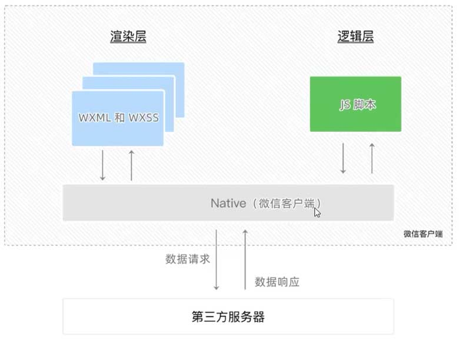

# 微信小程序-快速开始

* 小程序简介
* 第一个小程序
* 小程序代码的构成
* 小程序的宿主环境
* 协同工作和发布

## 1. 小程序简介

### 1.1. 与普通网页开发的区别

| -    | 网页        | 小程序                                         |
|------|-----------|---------------------------------------------|
| 运行环境 | 浏览器       | 微信                                          |
| API  | DOM、BOM   | 微信 API                                      |
| 开发模式 | 浏览器+代码编辑器 | 1.注册小程序开发账号<br>2.安装小程序开发者工具<br>3.创建和配置小程序项目 |

### 1.2. 体验小程序

官方小程序组件展示：


## 2. 第一个小程序

### 2.1. 注册小程序开发账号

步骤：

1. 进入官网: [https://mp.weixin.qq.com/](https://mp.weixin.qq.com/)
2. 注册“微信小程序”

查看 AppID（小程序ID）：

* 开发管理 -> 开发设置

参考：

* [小程序账号|被系统冻结问题汇总](https://zhuanlan.zhihu.com/p/613599044)

### 2.2. 微信开发者工具

介绍（主要功能）：

* 创建小程序项目
* 编码
* 调试
* 预览、发布

下载：

* 稳定版 Stable Build
* 地址： [https://developers.weixin.qq.com/miniprogram/dev/devtools/download.html](https://developers.weixin.qq.com/miniprogram/dev/devtools/download.html)

设置：

* 设置 -> 代理
* 代理设置：不使用任何代理

查看效果：

* 在模拟器上查看：点击“编译”按钮
* 在真手机上查看：点击“预览”按钮

模拟器：

* 机型：iPhone 6/7/8 (375 x 667 | Dpr:2)

## 3. 小程序代码的构成

### 3.1. 项目结构

```text
proj/
  pages/                      # 页面
  utils/                      # 工具
  .eslintrc.js
  app.js                      # 入口
  app.json                    # 全局配置
  app.wxss                    # 全局样式
  project.config.json         # 项目配置
  project.private.config.json
  sitemap.json                # 配置小程序及其页面能否被索引    
```

### 3.2. 页面组成

每个页面都是以单独文件夹存在，文件夹内包含四个基本文件

```text
pages/
  index/
    index.js        # 脚本
    index.json      # 配置
    index.wxml      # 结构
    index.wxss      # 样式
```

### 3.3. json 配置文件

小程序中有四种配置文件：

1. `proj/app.json`
2. `proj/project.config.json`
3. `proj/sitemap.json`
4. 页面的 .json 配置文件

#### 3.3.1. app.json

说明：

* 全局配置
* 所有页面的路径、窗口外观、界面变现、底部 tab 等

默认的 4 个配置项：

* pages: 所有页面的路径
* window: 所有页面的背景色、颜色等
* style: 小程序组件的样式版本
* sitemapLocation: sitemap.json 的位置

#### 3.3.2. project.config.json

说明：

* 小程序开发工具的配置

示例：

* setting: 编译相关的配置
* appid
* projectname: 项目名称（不是小程序的名称）

#### 3.3.3. sitemap.json

说明：

* 类似于网页的 SEO
* 配置小程序页面是否允许小程序索引

#### 3.3.4. 页面的 .json 配置文件

说明：

* 页面中的 .json 文件对本页面的窗口进行配置
* 会覆盖 app.json 中 window 属性中同名的配置项

### 3.4. 页面

#### 3.4.1. 新建页面

说明：

* 在 app.json 的 pages 数组新增一个页面路径，即自动生成页面模板

示例：

```json
{
  "pages":[
    "pages/index/index",
    // 新增该路径后，会自动生成 list 页面模板
    "pages/list/list"
  ]
}
```

#### 3.4.2. 修改项目首页

说明：

* app.json 的 pages 数组的第一个元素的路径即为首页

### 3.5. WXML 模板

#### 3.5.1. 什么是 WXML

WXML，WeiXin Markup Language，小程序设计的标签语言，用来构建页面结构

类似 HTML

#### 3.5.2. WXML 和 HTML 的区别

标签名称不同：

* HTML —— div, span, img, a
* WXML —— view, text, image, navigator

属性不同：

* `<a href="...">`
* `<navigator url="...">`

模板语法：

* 数据绑定
* 列表渲染
* 条件渲染

### 3.6. WXSS 样式

#### 3.6.1. 什么是 WXSS

WXSS，WeiXin Style Sheet，小程序设计的样式语言，用来描述页面样式

类似于 CSS

#### 3.6.2. WXSS 与 CSS 的区别

新增了 rpx 尺寸单位：（针对不同屏幕尺寸）

* CSS 中需要手动换算单位，如 rem
* WXSS 提供新的尺寸单位 rpx，自动换算

全局样式和局部样式：

* 全局样式 —— app.wxss
* 局部样式 —— 页面中的 .wxss 只作用当前页面

WXSS 支持绝大多数 CSS 选择器：

* class、id、element、并集、后代、::after、::before
* 等等

### 3.7. .js 文件

小程序中的 JS 文件有三大类：

1. app.js
   * 小程序的入口文件，调用 `App()` 函数启动小程序
2. 页面的 .js 文件
   * 页面的入口文件，调用 `Page()` 函数启动页面
3. 普通的 .js 文件

## 4. 小程序的宿主环境

### 4.1. 宿主环境介绍

#### 4.1.1. 什么是宿主环境

宿主环境（host, environment），程序运行所必须的依赖环境。

比如：

* 安卓 App 的宿主环境是 Android 系统
* iOS App 的宿主环境是 iOS 系统

#### 4.1.2. 小程序的宿主环境

手机微信就是小程序的宿主环境

小程序借助宿主环境提供的能力，可以完成许多普通网页无法完成的功能，如：

* 微信扫描
* 微信支付
* 微信登录
* 地理定位
* 等等

#### 4.1.3. 小程序宿主环境包含的内容

1. 通信模型
2. 运行机制
3. 组件
4. API

### 4.2. 通信模型

#### 4.2.1. 通信的主体

小程序中通信的主体是渲染层和逻辑层：

* 渲染层： WXML、WXSS
* 逻辑层： JS 脚本

#### 4.2.2. 小程序的通信模型

两部分：

* 渲染层 和 逻辑层 之间的通信： 由微信客户端转发
* 逻辑层 和 第三方服务器 之间的通信： 由微信客户端转发

图示：



### 4.3. 运行机制

#### 4.3.1. 小程序启动的过程

1. 下载代码包
2. 解析 app.json
3. 执行入口文件 app.js，调用 App() 创建小程序实例
4. 渲染首页
5. 启动完成

#### 4.3.2. 页面渲染的过程

1. 加载解析页面的 .json 配置文件
2. 加载页面的 .wxml 模板和 .wxss 样式
3. 执行的页面 .js 文件，调用 Page() 创建页面实例
4. 页面渲染完成

### 4.4. 组件

#### 4.4.1. 分类

小程序中的组件也是由宿主环境提供的，官方将其分为 9 大类：

1. 视图容器
2. 基础内容
3. 表单组件
4. 导航组件
5. 媒体组件
6. map 地图组件
7. canvas 画布组件
8. 开发能力
9. 无障碍访问

#### 4.4.2. 常用视图容器

view:

* 普通视图区域，块级元素，类似于 div
* 常用来实现页面的布局

scroll-view:

* 可滚动的视图区域，类似于设置 `overflow: auto` 的 div 容器
* 常用来实现滚动列表效果

swiper 和 swiper-item:

* 轮播图容器，轮播图 item

#### 4.4.3. view 组件

说明：

* 将其当做普通的 div 来使用即可
* 样式也当做普通的 css 即可

示例：

```html
<view class="box">
  <view>1</view>
  <view>2</view>
  <view>3</view>
</view>
```


#### 4.4.4. scroll-view 组件

示例：

```html
<!--
  横向滚动：scroll-x，在 wxss 设置容器的 width
  纵向滚动：scroll-y，在 wxss 设置容器的 height
-->
<scroll-view scroll-y>
  <view>1</view>
  <view>2</view>
  <view>3</view>
</scroll-view>
```

参考：[https://developers.weixin.qq.com/miniprogram/dev/component/view.html](https://developers.weixin.qq.com/miniprogram/dev/component/view.html)

#### 4.4.5. swiper 和 swiper-item

常用属性：

| 属性                      | 类型       | 默认值                | 必填	 | 说明              |
|-------------------------|----------|--------------------|-----|-----------------|
| indicator-dots	         | boolean  | 	false             | 否	  | 是否显示面板指示点       |
| indicator-color	        | color	   | rgba(0, 0, 0, .3)	 | 否   | 	指示点颜色	         |
| indicator-active-color	 | color    | 	#000000	          | 否   | 	当前选中的指示点颜色	    |
| autoplay                | 	boolean | 	false             | 	否  | 	是否自动切换         |
| current                 | 	number  | 	0                 | 	否  | 	当前所在滑块的 index	 |
| interval                | 	number  | 	5000              | 	否  | 	自动切换时间间隔	      |
| duration                | 	number  | 	500               | 	否  | 	滑动动画时长	        |

参考：[https://developers.weixin.qq.com/miniprogram/dev/component/swiper.html](https://developers.weixin.qq.com/miniprogram/dev/component/swiper.html)

#### 4.4.6. 常用基础内容组件

text:

* 文本组件
* 类似于 span，行内元素

rich-text:

* 富文本组件
* 支持把 HTML 字符串渲染为 WXML 结构

#### 4.4.7. text 组件

示例：

```html
<!--   
user-select	
  boolean	false	
  文本是否可选，该属性会使文本节点显示为 inline-block	
-->
手机号：<text user-select>18700007626</text>
```

参考：[https://developers.weixin.qq.com/miniprogram/dev/component/text.html](https://developers.weixin.qq.com/miniprogram/dev/component/text.html)

#### 4.4.8. rich-text 组件

示例：

```html
<rich-text nodes="<h1>哈哈</h1>"/>
```

参考：[https://developers.weixin.qq.com/miniprogram/dev/component/rich-text.html](https://developers.weixin.qq.com/miniprogram/dev/component/rich-text.html)

#### 4.4.9. 其他常用组件

button:

* 按钮组件
* 通过 open-type 属性调用微信的功能（客服、转发、用户授权、获取用户信息等）
* 参考：[https://developers.weixin.qq.com/miniprogram/dev/component/button.html](https://developers.weixin.qq.com/miniprogram/dev/component/button.html)

image:

* 图片组件
* 默认宽高为： 300px * 240px
* 示例：
  * `<image src="/images/1.png" mode="widthFix"></image>`
  * src: 
    * 以 `/` 打头的路径表示从项目根路径开始
  * mode: 图片裁剪、缩放的模式
    * scaleToFill: 默认，不保持纵横比缩放图片，使图片的宽高完全拉伸至填满 image 元素
    * aspectFit: 保持纵横比缩放图片，图片的长边能完全显示出来，短边两旁会有空白
    * aspectFill: 保持纵横比缩放图片，完全填满 image 元素，长边会有截取
    * widthFix: 宽度为 image 元素的宽度，高度自动变化，保持原图宽高比不变
    * heightFix: 高度为 image 元素的高度，宽度自动变化，保持原图宽高比不变
* 参考：[https://developers.weixin.qq.com/miniprogram/dev/component/image.html](https://developers.weixin.qq.com/miniprogram/dev/component/image.html)

navigator:

* 页面导航组件

### 4.5. API

宿主环境提供，可调用微信提供的功能，如：

* 获取用户信息
* 本地存储
* 支付功能

#### 4.5.1. 分类

事件监听 API:

* 以 on 打头
* 示例：`wx.onWindowResize(callback)`

同步 API:

* 以 Sync 结尾
* 示例：`wx.setStorageSync(key, value)`

异步 API:

* 通过回调函数处理数据，类似 `jQuery.ajax(options)`
* 示例：`wx.request({ success(){} })`
