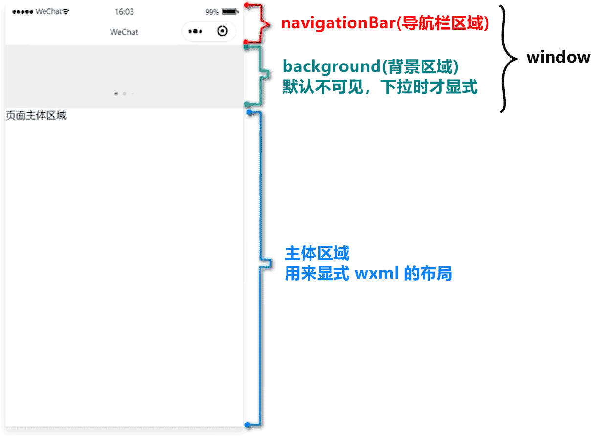

# 微信小程序-模板与配置

目标：

* 能够使用 WXML 模板语法渲染页面结构
* 能够使用 WXSS 样式美化页面结构
* 能够使用 app.json 对小程序进行全局配置
* 能够使用 page.json 对小程序页面进行个性化配置
* 能够知道如何发起网络数据请求

目录：

* WXML 模板语法
* WXSS 模板样式
* 全局配置
* 页面配置
* 网络数据请求
* 案例 - 本地生活（首页）

## 1. WXML 模板语法

### 1.1. 数据绑定

基本原则：

1. 在 data 中定义数据
2. 在 WXML 中使用数据

在 data 中定义页面的数据：

```js
Page({
  data: {  
    person: { name: '张三', age: 18 }
  }
})
```

mustache 语法：

* 双花括号，插值表达式
* 示例:
  * index.wxml
    
    ```html
    <view>{{ message }}</view>
    ```

  * index.js

    ```js
    Page({
      data: {
        message: 'hello world'
      },
    })
    ```
    
mustache 语法的应用场景：

* 绑定内容
  * `<view>{{ message }}</view>`
* 绑定属性
  * `<image src="{{ src }}"></image>`
* 运算（JS 表达式）
  * `<view>{{ flag === '1' ? '显式' : '隐藏' }}</view>`

### 1.2. 事件绑定

事件：

* 事件是渲染层到逻辑层的通信方式
* 通过事件可以将用户在渲染产生的行为，反馈到逻辑层进行业务处理

常用事件：

| 类型     | 绑定方式                     | 描述                     |
|--------|--------------------------|------------------------|
| tap    | bindtap 或 bind:tap       | 手指触摸后马上离开，类似网页中的 click |
| input  | bindinput 或 bind:input   | 文本框的输入事件               |
| change | bindchange 或 bind:change | 状态改变时触发                |

事件对象的属性列表：

| 属性             | 类型     | 说明              |
|----------------|--------|-----------------|
| type           | string | 事件类型            |
| timeStamp      | number | 页面打开到触发事件的时间    |
| target         | object | 触发事件的组件的一些属性值集合 |
| currentTarget  | object | 当前组件的一些属性值集合    |
| detail         | object | 额外信息            |
| touches        | array  | 触摸事件，触摸点信息      |
| changedTouches | array  | 触摸事件，变化的触摸点信息   |


target 和 currentTarget 的区别：

* 事件会冒泡
* e.target 是触发事件的源头组件
* e.currentTarget 是侦听该事件的组件
* 示例

    ```html
    <!--
      点击按钮后，handleTap 被调用：
        e.target 是 button
        e.currentTarget 是 view
    -->
    <view bindtap="handleTap">
      <button>按钮</button>
    </view>
    ```

bindtap：

* 在小程序中，没有 onclick 事件，而是通过 tap 事件响应用户的触摸行为的
* 示例：
  * index.wxml

    ```html
    <button
      type="primary"
      bind:tap="handleTapButton"
    >
      按钮
    </button>
    ```

  * index.js

    ```js
    Page({
      handleTapButton(event) {
        console.log(event)
      }
    })
    ```

在事件处理函数中为 data 中的数据赋值：

* 读：`this.data.message`
* 写：`this.setData({ message: 'xxx' })`
* 示例：
  * index.wxml 

    ```html
    <view>{{ count }}</view>
    <button bind:tap="handleTapButton">按钮</button>
    ```

  * index.js
  
    ```js
    Page({
      data: {
        count: 0,
      },
      handleTapButton(event) {
        this.setData({
          count: this.data.count + 1
        })
      }
    })
    ```

事件传参：

* 通过 data-* 传参
* 传：`<view bind:tap="handleTap" data-message="{{ '娃哈哈' }}">`
* 取：`event.target.dataset.message`
* 示例：
  * index.wxml

      ```html
      <view>{{ count }}</view>
      <button bind:tap="handleTapButton" data-step="{{ 2 }}">按钮</button>
      ```
  * index.js

      ```js
      Page({
        data: {
          count: 0,
        },
        handleTapButton(event) {
          const { step } = event.target.dataset;
      
          this.setData({
            count: this.data.count + step
          })
        }
      })
      ```

bindinput：

* 类似于网页的 input 事件
* 通过 event.detail.value 拿到最新的（变化后）文本框的值
* 示例
  * index.wxml

      ```html
      <input bind:input="handleInput"></input>
      ```

  * index.js

      ```js
      Page({
        handleInput(event) {
          console.log('event.detail.value:', event.detail.value);
        }
      })
      ```

文本框与 data 之间的数据同步：

* 类似双向数据绑定
* 示例：
  * index.wxml

      ```html
      <input value="{{ message }}" bind:input="handleInput"></input>
      ```

  * index.js

      ```js
      Page({
        data: {
          message: '123'
        },
        handleInput(event) {
          this.setData({ message: event.detail.value })
        }
      })
      ```

### 1.3. 条件渲染

`wx:if`：

* 通过 `wx:if="{{ condition }}"` 判断是否需要渲染该代码块
* 示例：

    ```html
    <view wx:if="{{ gender === 1 }}">男</view>
    <view wx:elif="{{ gender === 2 }}">女</view>
    <view wx:else>保密</view>
    ```

`<block>`:

* 同时操作多个组件，且该组件不会被渲染
* 类似 vue 的 `<template>` 标签
* 示例：

    ```html
    <block wx:if="{{ gender === 1}}">
      <view>1</view>
      <view>2</view>
      <view>3</view>
    </block>
    ```

hidden 属性：

* 通过 hidden 属性控制元素的显示与隐藏
* 内部通过 `display: none` 控制的，类似于 vue 的 v-show
* 示例：`<view hidden="{{ flag }}">娃哈哈</view>`

`wx:if` vs hidden:

* `wx:if` 通过动态 创建/移除 的方式控制元素的显示与隐藏
* hidden 通过 `display: none` 的方式控制元素的显示与隐藏

### 1.4. 列表渲染

`wx:for`：

* 循环渲染重复的组件结构
* 示例

    ```html
    <!--
      Page({
        data: {
          nums: [ 100, 200, 300 ]
        },
      })
    -->
    <view wx:for="{{ nums }}">
      {{ index }} - {{ item }}
    </view>
    ```
  
指定索引、当前项的名称：

* 通过 `wx:for-index`、`wx:for-item` 指定
* 示例

    ```html
    <view 
      wx:for="{{ nums }}"
      wx:for-index="i"
      wx:for-item="num"
    >
      {{ i }} - {{ num }}
    </view>
    ```
  
`wx:key`：

* 指定 key，提高渲染效率
* 示例：

    ```html
    <!--
      persons: [
        { id: 1, name: '张三' },
        { id: 2, name: '李四' },
        { id: 3, name: '王五' },
      ]
    -->
    <view wx:for="{{ persons }}" wx:key="id">
      {{ item.name }}
    </view>
    ```

## 2. WXSS 模板样式

什么是 WXSS：

* WeiXin Style Sheet
* 用于美化 WXML 的组件样式

WXSS 和 CSS 的关系：

* WXSS 具有 CSS 大部分特性
* WXSS 对 CSS 进行了扩充和修改
* 扩展的特性有：
  * `rpx`
  * `@import`

### 2.1. rpx

什么是 rpx 尺寸单位：

* responsive pixel
* 微信小程序独有的，用来解决屏幕适配的尺寸单位

rpx 的实现原理：

* 将屏幕宽度等分为 750 份，每一份为 1rpx，屏幕的宽度为 750rpx
* 小程序会自动将 rpx 换算为 px
* 建议设计师用 iPhone6 的屏幕尺寸作为视觉稿的标准，最好是 2 倍图

### 2.2. 样式导入

说明：

* 通过 `@import 相对路径` 导入外联样式表

示例：

* `@import '/common/common.wxss';`

### 2.3. 全局样式和局部样式

全局样式：

* 定义在 app.wxss 中的样式为全局样式，作用于每一个页面 

局部样式：

* 定义在页面的 .wxss 文件中样式为局部样式，只作用于当前页面
* 当局部和全局样式冲突时：
  * 权重大的生效
  * 相同权限，局部样式生效

## 3. 全局配置

全局配置文件：

* app.json 文件是小程序的全局配置文件

常用的配置项：

1. pages
   * 记录当前小程序所有页面的存放路径
2. window
   * 全局设置小程序窗口的外观
3. tabBar
   * 设置小程序底部的 tabBar 效果
4. style
   * 组件样式的版本

文档：

* [https://developers.weixin.qq.com/miniprogram/dev/reference/configuration/app.html](https://developers.weixin.qq.com/miniprogram/dev/reference/configuration/app.html)

### 3.1. window 配置项

小程序窗口的组成部分：

* window 可以设置 navigationBar、background
* 

window 配置项常用配置：

* 导航栏
  * navigationBarTitleText
    * string; 导航栏标题文字内容
  * navigationBarTextStyle
    * string; white; 导航栏标题颜色，仅支持 black / white
  * navigationBarBackgroundColor
    * HexColor; #000000; 导航栏背景颜色，如 #000000
* 背景
  * backgroundColor
    * HexColor; #ffffff; （下拉刷新时）窗口的背景色
  * backgroundTextStyle
    * string; dark; 下拉 loading 的样式，仅支持 dark / light
* 页面效果
  * enablePullDownRefresh
    * boolean; false; 是否开启全局的下拉刷新。
  * onReachBottomDistance
    * number; 50; 页面上拉触底事件触发时距页面底部距离，单位为 px。

标题：

* 标题内容：`navigationBarTitleText: string`
* 文本颜色：`navigationBarTextStyle: 'white' | 'black' = 'white'`
* 背景颜色：`navigationBarBackgroundColor: HexColor = '#000000'`

下拉刷新：

* 开启: `enablePullDownRefresh: boolean = false`
* 文本颜色：`backgroundTextStyle: 'dark' | 'light'` （三个小圆点的颜色）
* 背景颜色：`backgroundColor: HexColor = '#ffffff'` 
* 注意：模拟器上的下拉刷新效果 与 真机不一致

上拉触底：

* 说明：通过手指在屏幕上的上拉滑动操作，从而加载更多数据的行为
* 设置：`onReachBottomDistance: number = 50` （单位 px）
* 注意：不建议修改

### 3.2. tabBar

什么是 tabBar:

* 用于实现多页面的快速切换
* 分为：
  * 底部 tabBar
  * 顶部 tabBar
* 注意：
  * tabBar 的 tab 页签数量为 `[2, 5]`
  * 顶部 tabBar 只显示文本，不显示 icon
  * tabBar 对应的页面(在 pages 中)必须放在顶部 
* 文档：[reference/configuration/app.html#tabBar](https://developers.weixin.qq.com/miniprogram/dev/reference/configuration/app.html#tabBar)

tabBar 六个组成部分：

1. color
   * 文字颜色 
2. selectedColor
   * 被选中时的文字颜色
3. iconPath
   * 图标路径
4. selectedIconPath
   * 被选中时的图标路径
5. borderStyle
   * 上边框的样式（颜色）
6. backgroundColor
   * tabBar 背景色

`[app.json].tabBar` 属性的配置项：

| 属性              | 类型       | 必填 | 默认值    | 描述                                     | 最低版本  |
|-----------------|----------|----|--------|----------------------------------------|-------|
| color           | HexColor | 是  |        | tab 上的文字默认颜色，仅支持十六进制颜色                 |       |
| selectedColor   | HexColor | 是  |        | tab 上的文字选中时的颜色，仅支持十六进制颜色               |       |
| backgroundColor | HexColor | 是  |        | tab 的背景色，仅支持十六进制颜色                     |       |
| borderStyle     | string   | 否  | black  | tabbar 上边框的颜色， 仅支持 black / white       |       |
| list            | Array    | 是  |        | tab 的列表，详见 list 属性说明，最少 2 个、最多 5 个 tab |       |
| position        | string   | 否  | bottom | tabBar 的位置，仅支持 bottom / top            |       |
| custom          | boolean  | 否  | false  | 自定义 tabBar，见详情                         | 2.5.0 |


`[app.json].tabBar.list` 属性的配置项：

| 属性               | 类型     | 必填 | 说明                                                                                   |
|------------------|--------|----|--------------------------------------------------------------------------------------|
| pagePath         | string | 是  | 页面路径，必须在 pages 中先定义                                                                  |
| text             | string | 是  | tab 上按钮文字                                                                            |
| iconPath         | string | 否  | 图片路径，icon 大小限制为 40kb，建议尺寸为 81px * 81px，不支持网络图片。 <br>当 position 为 top 时，不显示 icon。     |
| selectedIconPath | string | 否  | 选中时的图片路径，icon 大小限制为 40kb，建议尺寸为 81px * 81px，不支持网络图片。 <br>当 position 为 top 时，不显示 icon。 |

### 3.3. tabBar 示例

app.json:

```json
{
  "pages": [
    "pages/home/home",
    "pages/message/message",
    "pages/user-center/user-center"
  ],
  "tabBar": {
    "list": [
      {
        "pagePath": "pages/home/home",
        "text": "首页",
        "iconPath": "/images/tabs/home.png",
        "selectedIconPath": "/images/tabs/home-active.png"
      },
      {
        "pagePath": "pages/message/message",
        "text": "消息",
        "iconPath": "/images/tabs/message.png",
        "selectedIconPath": "/images/tabs/message-active.png"
      },
      {
        "pagePath": "pages/user-center/user-center",
        "text": "我的",
        "iconPath": "/images/tabs/user-center.png",
        "selectedIconPath": "/images/tabs/user-center-active.png"
      }
    ]
  }
}
```

## 4. 页面配置

页面配置文件的作用：

* 小程序中，每个页面都有自己的 .json 配置文件
* 用于配置当前页面的窗口外观、页面效果

页面配置和全局配置的关系：

* `[app.json].window` 属性可以全局配置每个页面的窗口表现
* 页面级别的 .json 配置文件对当前页面进行单独配置
* 当配置冲突时，页面基本的配置优先级高

配置项：

* 参考：[reference/configuration/page.html](https://developers.weixin.qq.com/miniprogram/dev/reference/configuration/page.html)

## 5. 网络数据请求

小程序中网络数据请求的限制：

1. 只能请求 HTTPS 类型的接口
2. 接口的域名必须在信任列表中

配置 request 合法域名：

* 管理后台 -> 开发 -> 开发管理：开发设置 -> 服务器域名
* 注意：
  * HTTPS 协议
  * ICP 备案
  * 不能使用 IP 或 localhost
  * 一个月最多修改 5 次
