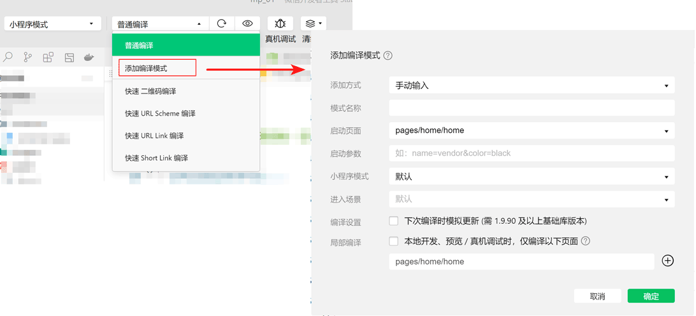

# 微信小程序-视图与逻辑

目标：

* 页面之间的导航跳转
* 下拉刷新
* 上拉加载更多
* 常用生命周期函数

目录：

* 页面导航
* 页面事件
* 生命周期
* WXS 脚本

## 1. 页面导航

实现导航的两种方式：

* 声明式导航：使用 `<navigator>` 组件
* 编程式导航：使用导航 API

### 1.1. 声明式导航

导航到 tabBar 页面：

```html
<!--  
  必须指定 url 和 open-type:

    url: 必须以 “/” 打头

    open-type: 值为 "switchTab"
-->
<navigator
  url="/pages/message/message"
  open-type="switchTab"
>
  导航到 tabBar 页面 - 消息页面
</navigator>
```

导航到非 tabBar 页面：

```html
<!--  
    open-type 默认值为 "navigate"
-->
<navigator
  url="/pages/about/about"
  open-type="navigate"
>
  导航到非 tabBar 页面 - 关于页面
</navigator>
```

后退导航：

```html
<!--  
  delta：
    后退几步，默认值为 1
-->
<navigator
  open-type="navigateBack"
  delta="1"
>
  后退一步
</navigator>
```

参考：

* [miniprogram/dev/component/navigator.html](https://developers.weixin.qq.com/miniprogram/dev/component/navigator.html)

### 1.2. 编程式导航

导航到 tabBar 页面：

```javascript
/*  
  参考：https://developers.weixin.qq.com/miniprogram/dev/api/route/wx.switchTab.html
*/
wx.switchTab({
  url: '/pages/message/message',
})
```

导航到非 tabBar 页面：

```javascript
/*  
  参考：https://developers.weixin.qq.com/miniprogram/dev/api/route/wx.navigateTo.html
*/
wx.navigateTo({
  url: '/pages/about/about',
});
```

后退导航：

```javascript
/*  
  参考：https://developers.weixin.qq.com/miniprogram/dev/api/route/wx.navigateBack.html
*/
wx.navigateBack({
  delta: 1, // 默认值为 1
});

wx.navigateBack();
```

### 1.3. 导航传参

声明式导航传参：

```html
<!--  
  query 传参    
-->
<navigator
  url="/pages/about/about?namge=zhangsan&age=18"
>
  导航到非 tabBar 页面 - 关于页面，query 传参
</navigator>
```

编程式导航传参：

```javascript
/*  
  query 传参
*/
wx.navigateTo({
  url: '/pages/about/about?name=李四&age=20',
})
```

在 onLoad 中接受导航参数：

```javascript
Page({
  data: {
    query: {},
  },

  /**
   * options 接受 query 传递过来的参数
   */
  onLoad(options) {
    this.setData({
      query: options,
    });
  },
})
```

## 2. 页面事件

### 2.1. 下拉刷新事件

说明：

* 下拉刷新是移动端的专有名词
* 指的是通过手指在屏幕上的下拉滑动操作，从而重新加载页面数据的行为

开启：

* 全局开启： `[app.json].window.enablePullDownRefresh = true`
* 单独开启： `[页面.json].enablePullDownRefresh = true`

样式：

* 文本颜色：`backgroundTextStyle: 'dark' | 'light'` （三个小圆点的颜色）
* 背景颜色：`backgroundColor: HexColor = '#ffffff'`

示例：（样式）

```json
// /message/message/message.json
{
    "enablePullDownRefresh": true,
    "backgroundColor": "#efefef",
    "backgroundTextStyle": "dark"
}
```

事件处理函数：

```javascript
// 内置事件处理函数 onPullDownRefresh
Page({
  /**
   * 页面相关事件处理函数--监听用户下拉动作
   */
  onPullDownRefresh() {
    console.log('触发了 message 页面的下拉刷新');
  },

})
```

停止下拉刷新的动画：

* 触发下拉刷新后，动画效果会一直显示，不会主动消失
* 需要调用 [wx.stopPullDownRefresh()](https://developers.weixin.qq.com/miniprogram/dev/api/ui/pull-down-refresh/wx.stopPullDownRefresh.html) 将其关闭
* 示例：

    ```javascript
    Page({
      // 此时，下拉刷新效果只有 2 秒钟左右
      onPullDownRefresh() {
        console.log('触发了 message 页面的下拉刷新');
        wx.stopPullDownRefresh();
      },
    })
    ```

### 2.2. 上拉触底

说明：

* 上拉触底是移动端的专有名词
* 通过手指在屏幕上的上拉滑动操作，从而加载更多数据的行为

事件处理函数：

```javascript
Page({
 /**
   * 页面上拉触底事件的处理函数
   * 
   * 一旦触底就会执行，需要进行节流处理
   */
  onReachBottom() {
    console.log('触发了 message 页面的上拉触底');
  },
})
```

配置上拉触底距离：

* 说明：触发上拉触底事件时，滚动条距离页面底部的距离
* 设置：`onReachBottomDistance: number = 50` （单位 px）
* 注意：不建议修改

loading 提示效果 与 节流处理：

```javascript
/*
参考：
  https://developers.weixin.qq.com/miniprogram/dev/api/ui/interaction/wx.showLoading.html
 */
Page({
  data: {
    list: [],
    isLoading: false, // 节流阀
  },

  getList() {
    wx.showLoading({ title: '加载中...' });

    this.setData({ isLoading: true });

    wx.request({
      complete: () => {
        wx.hideLoading();

        this.setData({ isLoading: false });
      },
      // ...
    });
  },

  onReachBottom() {
    if (this.data.isLoading) {
      return;
    }

    this.getList();
  },
})
```

### 2.3. 扩展：编译模式

说明：

* 通过自定义编译模式，可以指定 初始启动页面及页面参数

示例：



## 3. 生命周期

说明：

* 生命周期（Life Cycle）是指一个对象从 创建->运行->销毁 的整个阶段，强调的是一个时间段

生命周期的分类：

* 应用生命周期：小程序 从 启动->运行->销毁 的整个过程
* 页面生命周期：每个页面 从 加载->渲染->销毁 的整个过程

生命周期函数：

* 说明：由小程序框架提供的内置函数，会伴随着生命周期，自动按次序执行
* 作用：允许程序员在特定的时间点，执行某些特定的操作
* 注意：生命周期 强调的是 时间段，生命周期函数 强调的是 时间点
* 示例：页面刚加载时，可以在 onLoad 生命周期函数中初始化页面的数据

生命周期函数的分类：

* 应用生命周期函数：小程序 从 启动->运行->销毁 期间，依次调用的那些函数
* 页面生命周期函数：每个页面 从 加载->渲染->销毁 期间，依次调用的那些函数

应用的生命周期函数：

```javascript
// app.js
// 参考：https://developers.weixin.qq.com/miniprogram/dev/reference/api/App.html
App({ 
  // 当小程序初始化完成时，会触发 onLaunch（全局只触发一次）
  onLaunch: function () { },

  // 当小程序启动，或从后台进入前台显示，会触发 onShow
  onShow: function (options) { },

  // 当小程序从前台进入后台，会触发 onHide
  onHide: function () { },

  // 当小程序发生脚本错误，或者 api 调用失败时，会触发 onError 并带上错误信息
  onError: function (msg) { }
})
```

页面的生命周期函数：

```javascript
// pages/user-center/user-center.js
// 参考：https://developers.weixin.qq.com/miniprogram/dev/reference/api/Page.html
Page({
  // 监听页面加载，一个页面只调用一次
  onLoad(options) { },

  // 监听页面初次渲染完成，一个页面只调用一次
  onReady() { },

  // 监听页面显示
  onShow() { },

  // 监听页面隐藏
  onHide() { },

  // 监听页面卸载，一个页面只调用一次
  onUnload() { },
});
```

## 4. WXS 脚本

### 4.1. 概述

说明：

* WXS（WeiXin Script）是小程序独有的一套脚本语言
* 结合 WXML，可以构建出页面的结构

应用场景：

* WXML 中可以调用 wxs 中定义的函数
* 可以用作 “过滤器”

WXS 与 JS 的区别：

* WXS 支持 ES5 语法
* WXS 遵循 CommonJS 规范： `module` 、 `require()` 、 `module.exports`