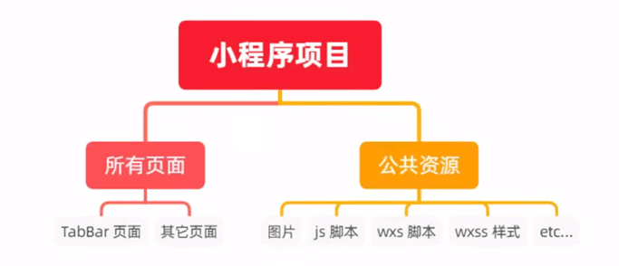
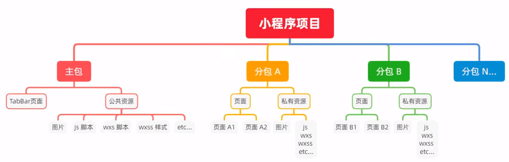
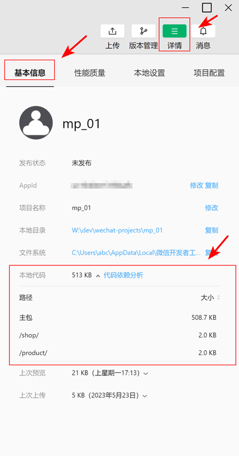

# 微信小程序-基础加强

目标：

* 自定义小程序组件
* 小程序组件中的 behaviors 的作用
* 安装和配置 vant-weapp 组件库
* MobX 全局数据共享
* 小程序 API 的 Promise 化

目录：

* 自定义组件
* 使用 npm 包
* 全局数据共享
* 分包

## 1. 自定义组件

### 1.1. 组件的创建和引用

创建组件（header）的步骤：

1. 创建 `/components/header` 目录
2. 在 header 目录上右击，选择 “新建 Component” 后，输入组件名称 “header”
3. 微信开发者工具会自动创建组件相关文件

    ```text
    proj/
      components/
        header/
          header.js
          header.json
          header.wxml
          header.wxss
    ```


引用组件：

* 局部引用：当前页面内有效
* 全局引用：所有页面内有效

局部引用组件：

1. 在 `[页面.json].usingComponents` 中引用组件

    ```json
    {
      "usingComponents": {
        "my-header": "/components/header/header"
      }
    }
    ```

2. 在 `页面.wxml` 中使用组件

    ```html
    <!--pages/home/home.wxml-->
    <my-header></my-header>
    ```

全局引用组件：

1. 在 `[app.json].usingComponents` 中引用组件

    ```json
    {
      "usingComponents": {
        "my-body": "/components/body/body"
      }
    }
    ```

2. 在 `页面.wxml` 中使用组件

    ```html
    <!--pages/home/home.wxml-->
    <my-body></my-body>
    ```

组件和页面的区别：

1. `[组件.json]`

    ```json
    {
      // 额外的 component 属性，标记其为 component
      "component": true
    }
    ```

2. `[组件.js]`

    ```javascript
    // 使用 Component()， 而非 Page()
    Component({

      // 事件处理函数需要定义在 methods 选项里
      methods: {}
    })
    ```

### 1.2. 样式

组件样式隔离：

* 组件 A 的样式 不会影响 组件 C 的样式
* 组件 A 的样式 不会影响 小程序页面的样式
* 小程序页面的样式 不会影响 组件 A 的样式

组件样式隔离注意点：

* `app.wxss` 中的 class 选择器对组件 无效
* `app.wxss` 中的 id 选择器、属性选择器、标签选择器对组件 有效

修改组件的样式隔离选项：

* 修改位置

    ```javascript
    // `组件.js` 中修改
    Component({
      options: {
        styleIsolation: "apply-shared"
      }
    })

    // 组件.json` 中修改
    {
      "styleIsolation": "apply-shared"
    }
    ```

* 可选值：

  * `isolated`: 启用样式隔离，在自定义组件内外，使用 class 指定的样式将不会相互影响（一般情况下的默认值）
  * `apply-shared`: 表示页面 wxss 样式将影响到自定义组件，但自定义组件 wxss 中指定的样式不会影响页面；
  * `shared`: 表示页面 wxss 样式将影响到自定义组件，自定义组件 wxss 中指定的样式也会影响页面和其他设置了 apply-shared 或 shared 的自定义组件。（这个选项在插件中不可用。）

* 参考：[miniprogram/dev/framework/custom-component/wxml-wxss.html](https://developers.weixin.qq.com/miniprogram/dev/framework/custom-component/wxml-wxss.html#%E7%BB%84%E4%BB%B6%E6%A0%B7%E5%BC%8F%E9%9A%94%E7%A6%BB)

### 1.3. 数据、方法、属性

data 数据：

* 定义：

    ```javascript
    Component({
      data: {
        count: 1,
      }
    })
    ```

* 读、写：

    ```javascript
    // 读
    this.data.count
    // 写
    this.setData({ count: 2 })
    ```


methods 方法：

* 事件处理函数、自定义方法 都要定义到 method 选项中：

    ```javascript
    Component({
      data: {
        count: 1,
      },
      methods: {
        // 事件处理函数
        handleTapButton() {
          this.setData({
            count: this.data.count + 1
          });

          this._showCount();
        },

        // 自定义方法，建议使用 “_” 打头
        _showCount() {
          wx.showToast({
            title: `当前 count: ${ this.data.count }`,
          })
        }
      }
    })
    ```

properties 属性：

* 说明：用于接受外界传递给组件的数据，类比 vue 中的属性传参
* 定义：

    ```javascript
    Component({
      properties: {
        // 完整写法
        max: {
          type: Number, // 类型
          value: 10,    // 默认值
        },

        // 简化写法
        step: Number,   // 默认为 0
      },

      methods: {
        handleTapButton() {
          // 读
          this.properties.max; 

          // 写
          this.setData({
            max: 20,
          });
        }
      },
    });
    ```

* 使用

    ```html
    <my-component max="9"></<my-component>>
    ```

data 和 properties 的区别：

* `this.data` 和 `this.properties` 指向同一个对象

    ```javascript
    Component({
      data: {
        count: 1,
      },
      properties: {
        max: {
          type: Number,
          value: 10,
        },
      },
      methods: {
        handleTapButton() {
          console.log(this.data);       // {count: 1, max: 10}
          console.log(this.properties); // {count: 1, max: 10}
          console.log(this.data === this.properties); // true
        },
      }
    })
    ```

* properties 里的属性也可以在模板中直接使用

### 1.4. 数据监听器

说明：

* 监听 属性和数据 字段的变化
* 类比 vue 的 watch

基本语法：

* 组件.js:

    ```javascript
    Component({
      data: {
        num1: 0,
      },
      properties: {
        num2: Number,
      },
      observers: {
        // 多个字段用英文逗号分隔
        'num1, num2': function(newNum1, newNum2) {
          // ...
        }
      },
    });
    ```

示例：

* 组件.wxml:

    ```html
    <view>{{ num1 }} + {{ num2 }} = {{ sum }}</view>

    <button bindtap="handleTapButton1">num1++</button>
    <button bindtap="handleTapButton2">num2++</button>
    ```
  
* 组件.js:

    ```javascript
    // components/header/header.js
    Component({
      data: {
        num1: 0,
        sum: 0,
      },
      properties: {
        num2: {
          type: Number,
          value: 0,
        },
      },
      observers: {
        'num1, num2': function(newNum1, newNum2) {
          this.setData({ sum: newNum1 + newNum2});
        },
      },
      methods: {
        handleTapButton1() {
          this.setData({ num1: this.data.num1 + 1 });
        },
        handleTapButton2() {
          this.setData({ num2: this.data.num2 + 1 });
        },
      }
    })
    ```  

监听对象的属性：

* 可以监听对象的 单个、多个、所有 的属性变化
    
    ```javascript
    Component({
      data: {
        person: { name: '张三', age: 18, gender: '男' }
      },
      observers: {
        /*
          单个属性

          触发情况：
            this.setData({ 'person.name': 'ZS' })   // 修改 对象的属性
            this.setData({ person: {} })            // 修改 对象
        */
        'person.name': function (newName) {
          // ...
        },

        // 多个属性
        'person.name, person.age': function (newName, newAge) {
          // ...
        },

        // 所有属性，使用通配符 ** 监听对象所有的属性
        'person.**': function (obj) {
          // obj.name
          // obj.age
          // obj.gender
        },

      }
    });
    ```

### 1.5. 纯数据字段

纯数据字段：

* 概念：不用于界面渲染的 data 字段
* 应用：某些 data 中的字段既不会展示在界面上，也不会传递给其他组件，仅在当前组件内部使用，可用定义为纯数据字段
* 好处：提升页面更新的性能

使用：

* 符合 `options.pureDataPattern` 正则的数据字段为 纯数据字段

    ```javascript
    Component({
      options: {
        // 以 _ 打头的数据字段为 纯数据字段
        pureDataPattern: /^_/,
      },

      data: {
        // 纯数据字段
        _isLoading: false,

        // 普通数据字段
        list: [],
      }
    })
    ```

### 1.6. 组件的生命周期

全部的生命周期函数：

| 生命周期 | 	参数 | 	描述 |
| - | - | - |
| created | 	无 | 	在组件实例刚刚被创建时执行 |
| attached | 	无 | 	在组件实例进入页面节点树时执行 |
| ready | 	无 | 	在组件在视图层布局完成后执行 |
| moved | 	无 | 	在组件实例被移动到节点树另一个位置时执行 |
| detached | 	无 | 	在组件实例被从页面节点树移除时执行 |
| error | 	Object Error | 	每当组件方法抛出错误时执行 |

主要的生命周期函数：

| 生命周期 | 	说明 | 	应用场景 |
| - | - | - |
| created | setData 不可用 | 	给 this 添加自定义的属性字段 |
| attached | 	this.data 初始化完毕 | 	初始化工作（如发送请求） |
| detached | 	退出页面时触发 | 	清理工作 |


定义位置：

* 在 lifetimes 节点中使用生命周期函数

    ```javascript
    Component({
      lifetimes: {
        attached: function() { /* ...  */ },
        detached: function() { /* ...  */ },
      },
    })
    ```

参考：

* [miniprogram/dev/framework/custom-component/lifetimes.html](https://developers.weixin.qq.com/miniprogram/dev/framework/custom-component/lifetimes.html)


### 1.7. 组件所在页面的生命周期

说明：

* 组件监听页面状态（show/hide/resize）的变化

生命周期函数：

| 生命周期 | 参数 | 描述 | 最低版本 |
| - | - | - | - |
| show | 无 | 组件所在的页面被展示时执行 | 2.2.3 |
| hide | 无 | 组件所在的页面被隐藏时执行 | 2.2.3 |
| resize | Object Size | 组件所在的页面尺寸变化时执行 | 2.4.0 |
| routeDone | 无 | 组件所在页面路由动画完成时执行 | 2.31.2 |

定义位置：

* 在 pageLifetimes 节点中定义：

    ```javascript
    Component({
      pageLifetimes: {
        show: function() {},        // 页面被展示
        hide: function() {},        // 页面被隐藏
        resize: function(size) {}   // 页面尺寸变化
      }
    })
    ```

### 1.8. 插槽

说明：

* `<slot>` 节点
* 用于承载组件使用者提供的 wxml 结构
* 类比 vue 中的插槽

单个插槽：

* 默认情况下，每个组件只允许有一个插槽
* 类比 vue 中的默认插槽，但不能给插槽设置默认内容
* 示例：

    ```html
    <!-- my-test1 组件中 定义插槽 -->
    <view>
      <view>组件自身的内容</view>
      <slot></slot>
    </view>


    <!-- home 页面中 使用插槽 -->
    <my-test1>
      <view>使用者提供的结构</view>
    </my-test1>
    ```

多个插槽：

* 通过 `options.multipleSlots = true` 启用多个插槽：

    ```javascript
    Component({
      options: {
        multipleSlots: true, // 启用多个插槽
      }
    })
    ```

* 类比 vue 中的具名插槽
* 示例：

    ```html
    <!-- my-test2 组件中 定义插槽 -->
    <view>
      <slot name="header"></slot>

      <view>1111111111</view>
      <view>2222222222</view>

      <slot name="footer"></slot>
    </view>


    <!-- home 页面中 使用插槽 -->
    <my-test2>
      <view slot="header">xxxxx</view>  
      <view slot="footer">yyyyy</view>  
    </my-test2>
    ```

### 1.9. 父子组件通信

父子组件之间通信的方式：

1. 属性绑定

    * 父传子，给子组件的 指定属性 设置数据（JSON 兼容的数据）

2. 事件绑定

    * 子传父，向父组件传递数据（任意类型）

3. 获取组件实例

    * 父组件通过 `this.selectComponent()` 获取子组件实例对象
    * 父组件直接访问子组件的任意数据和方法

属性绑定：

* 说明：类别 vue
* 注意：子组件可以通过 `this.setData()` 修改属性的值
* 示例：

    ```javascript
    // 子组件
    Component({
      properties: {
        count: Number,
      },
    })


    // 父组件（页面）
    Page({
      data: {
        count: 0,
      },
    });

    <my-test3 count="{{ count }}"></my-test3>
    ```

事件绑定：

* 类比 vue
* 示例：

    ```javascript
    // 父组件（页面）
    Page({
      // 自定义方法（自定义事件处理函数）
      syncCount(e) {
        e.detail; // e.detail 为传递过来的数据
      }
    })

    // 侦听自定义事件
    // bind:自定义事件="自定义事件处理函数"
    <my-test3 bind:syncCount="syncCount"></my-test3>


    // 子组件
    Component({
      methods: {
        handleTapButton() {
          // 触发自定义事件 syncCount，并传递数据
          this.triggerEvent('syncCount', { value: this.properties.count });
        }
      }
    })
    ```

获取组件实例：

* 说明：通过 `this.selectComponent(ID选择器 或 class选择器)` 获取子组件实例

### 1.10. behaviors

说明：

* behaviors 用于组件间代码共享（复用）
* 类似 vue 的 mixins

工作方式：

* 每个 behavior 可以包含 属性、数据、方法、生命周期函数，组件引用 behavior 后，会合并到组件中去
* 每个组件可以引用多个 behavior
* behavior 也可以引用其它 behavior
* 参考：
  * [miniprogram/dev/framework/custom-component/behaviors.html](https://developers.weixin.qq.com/miniprogram/dev/framework/custom-component/behaviors.html)
  * [miniprogram/dev/reference/api/Behavior.html](https://developers.weixin.qq.com/miniprogram/dev/reference/api/Behavior.html)


创建 behavior：

```javascript
// /behaviors/my-behavior.js

export default Behavior({
  data: {
    num: 10,
  }
});
```

导入并使用 behavior：

```javascript
// /components/test3/test3.js

// 导入
import myBehavior from '../../behaviors/my-behavior';

Component({
  // 使用
  behaviors: [ myBehavior ],
})

// /components/test3/test3.wxml
<view>{{ num }}</view>
```

behavior 的参数：

| 定义段 | 类型 | 是否必填 | 描述 |	最低版本 |
| - | - | - | - |	- |
| properties | Object Map |	否 | 组件的对外属性，是属性名到属性设置的映射表	 | |
| data | Object | 否 | 组件的内部数据，和 properties 一同用于组件的模板渲染	 | |
| observers | Object | 否 | 组件数据字段监听器，用于监听 properties 和 data 的变化，参见 数据监听器	| 2.6.1 |
| methods | Object | 否 | 组件的方法，包括事件响应函数和任意的自定义方法，关于事件响应函数的使用，参见 组件间通信与事件	 | |
| behaviors | String Array | 否 |	类似于 mixins 和 traits 的组件间代码复用机制，参见 behaviors	 | |
| created | Function | 否 | 组件生命周期函数-在组件实例刚刚被创建时执行，注意此时不能调用 setData 	 | |
| attached | Function | 否 | 组件生命周期函数-在组件实例进入页面节点树时执行	 | |
| ready | Function | 否 | 组件生命周期函数-在组件布局完成后执行	 | |
| moved | Function | 否 | 组件生命周期函数-在组件实例被移动到节点树另一个位置时执行	 | |
| detached | Function | 否 | 组件生命周期函数-在组件实例被从页面节点树移除时执行	 | |
| relations | Object | 否 | 组件间关系定义，参见 组件间关系	 | |
| lifetimes | Object | 否 | 组件生命周期声明对象，参见 组件生命周期	| 2.2.3 |
| pageLifetimes | Object | 否 | 组件所在页面的生命周期声明对象，参见 组件生命周期	| 2.2.3 |
| definitionFilter | Function | 否 | 定义段过滤器，用于自定义组件扩展，参见 自定义组件扩展	| 2.2.3 |

同名字段的处理规则：

* 参考：[miniprogram/dev/framework/custom-component/behaviors.html](https://developers.weixin.qq.com/miniprogram/dev/framework/custom-component/behaviors.html)

## 2. 使用 npm 包


小程序不支持的 npm 包：

* 依赖 node环境 的包，如依赖 `fs` 、`path`
* 依赖 浏览器环境 的包，如依赖 `window` 对象
* 依赖 C++ 插件的包

### 2.1. Vant Weapp

说明：

* Vant Weapp 是有赞前端团队开源的一套小程序 UI 组件库
* MIT 开源许可协议
* 官方文档：[https://youzan.github.io/vant-weapp](https://youzan.github.io/vant-weapp)

微信开发者工具版本：

* Stable 1.06.2306020

安装：（参考官方文档的“快速上手”）

1. 通过 npm 安装

    ```shell
    # 创建 package.json 文件
    npm init -y

    # 安装 npm 包，此时生成 node_modules 目录
    npm i @vant/weapp -S --production

    ## "@vant/weapp": "^1.10.19"
    ```

2. 修改 app.json

    * 去掉 app.json 中的 `"style": "v2"` 

3. 修改 project.config.json

    ```json
    {
      ...
      "setting": {
        ...
        "packNpmManually": true,
        
        "packNpmRelationList": [
          {
            "packageJsonPath": "./package.json",
            "miniprogramNpmDistDir": "./"
          }
        ]
      }
    }
    ```

4. 构建 npm 包

    * 打开微信开发者工具，点击 工具 -> 构建 npm
    * 构建完成后，项目生成 miniprogram_npm 目录
    * 每次安装新的 npm 包，都要重新构建
    * 每次构建前最好把 miniprogram_npm 目录删除掉

使用：

* 在 app.json 中引入

    ```json
    {
      "usingComponents": {
        "van-button": "@vant/weapp/button/index"
      }
    }
    ```

* 在 页面.wxml 中使用

    ```html
    <van-button type="default">默认按钮</van-button>
    <van-button type="primary">主要按钮</van-button>
    <van-button type="info">信息按钮</van-button>
    <van-button type="warning">警告按钮</van-button>
    <van-button type="danger">危险按钮</van-button>
    ```

定制全局主题样式：

* 说明：在 app.wxss 中，写入 CSS 变量，即可对全局生效
* 注意：定制使用的 CSS 变量 与 Less 变量 同名，所有可用的颜色变量请参考 [配置文件](https://github.com/youzan/vant-weapp/blob/dev/packages/common/style/var.less)。
* 示例：

    ```css
    /* page 为页面的根元素 */
    page {
      --button-border-radius: 10px;
      --button-default-color: #f2f3f5;
      --toast-max-width: 100px;
      --toast-background-color: pink;
    }
    ```

### 2.2. API Promise 化

说明：

* 小程序官方提供的异步 API 都是基于回调函数实现的
* 容易造成回调地狱的问题

API Promise 化：

* 说明：通过 miniprogram-api-promise 这个第三方 npm 包实现
* 注意：这个 npm 包已经长时间未更新，不建议使用。
* 文档：[wechat-miniprogram / miniprogram-api-promise](https://github.com/wechat-miniprogram/miniprogram-api-promise)

## 3. 全局数据共享

说明：

* 全局数据共享，又叫做 状态管理
* 为了解决组件之间数据共享的问题
* 小程序中推荐使用 [MobX](https://github.com/wechat-miniprogram/mobx-miniprogram-bindings)

安装：

```shell
# 安装
npm i mobx-miniprogram mobx-miniprogram-bindings

## "mobx-miniprogram": "^4.13.2",
## "mobx-miniprogram-bindings": "^2.1.5"

# 删除 miniprogram_npm 目录
rmdir /s/q miniprogram_npm

# 微信开发者工具 -> 工具 -> 构建 npm
```

定义：（Store 实例）

```javascript
// /store/store.js

import { observable, action } from 'mobx-miniprogram';

export const store = observable({
  // 数据字段
  num1: 1,
  num2: 2,

  // 计算属性
  get sum() {
    return this.num1 + this.num2;
  },

  // action 方法，用来修改数据字段
  updateNum1: action(function(delta) {
    this.num1 += delta;
  }),
  updateNum2: action(function(delta) {
    this.num2 += delta;
  }),
});
```

绑定：

* 在 page 中绑定：

    ```javascript
    // pages/home/home.js
    import { createStoreBindings } from 'mobx-miniprogram-bindings';
    import { store } from '../../store/store';

    Page({
      onLoad() {
        // 绑定
        this.storeBindings = createStoreBindings(this, {
          store,
          fields: ['num1', 'num2', 'sum'],
          actions: ['updateNum1', 'updateNum2'],
        });
      },
      onUnload() {
        // 销毁
        this.storeBindings.destroyStoreBindings();
      },
    });
    ```
* 在 component 中绑定：

    ```javascript
    // components/test1/test1.js
    import { storeBindingsBehavior } from "mobx-miniprogram-bindings";
    import { store } from '../../store/store';

    Component({
      behaviors: [storeBindingsBehavior],
      storeBindings: {
        store,
        fields: ['num1', 'num2', 'sum'],
        actions: ['updateNum1', 'updateNum2'],
      },
      methods: {
        handleTapAddButton(e) {
          const { delta } = e.target.dataset;
          this.updateNum1(delta);
        },
        handleTapSubtractButton(e) {
          const { delta } = e.target.dataset;
          this.updateNum2(delta);
        },
      },
    });
    ```

* 绑定配置：

    ```text
    store

      一个 MobX observable


    fields

      数组形式

        {
          fields: ['numA', 'numB', 'sum'], // this.data.numA === store.numA
        }

      映射形式

        {
          fields: { 
            a: 'numA',  // this.data.a === store.numA
            b: 'numB',  // this.data.b === store.numB
          }
        }

      函数形式

        {
          fields: { 
            a: () => store.numA,        // this.data.a === store.numA
            b: () => anotherStore.numB  // this.data.b === anotherStore.numB
          } 
        }


    actions

      数组形式

        {
          actions: ['update']   // this.update === store.update
        }

      映射形式

        {
          actions: { buttonTap: 'update' }   // this.buttonTap === store.update
        }
    ```


使用：

```javascript
// page/home/home.wxml
<view>{{ num1 }} + {{ num2 }} = {{ sum }}</view>

<van-button 
  type="primary"
  bindtap="handleTapAddButton"
  data-delta="{{ 1 }}"
>
  num1 + 1
</van-button>
<van-button 
  type="danger"
  bindtap="handleTapSubtractButton"
  data-delta="{{ -1 }}"
>
  num2 - 1
</van-button>


// pages/home/home.js
Page({
  // ...

  handleTapAddButton(e) {
    const { delta } = e.target.dataset;
    this.updateNum1(delta);
  },
  handleTapSubtractButton(e) {
    const { delta } = e.target.dataset;
    this.updateNum2(delta);
  },
});
```

## 4. 分包

参考：[miniprogram/dev/framework/subpackages/basic.html](https://developers.weixin.qq.com/miniprogram/dev/framework/subpackages/basic.html)

### 4.1. 基础概念

说明：

* 将一个完整的小程序项目，划分为不同的子包
* 在构建时，打包成不同的分包，用户在使用时按需加载

好处：

* 减少小程序首次启动的下载时间
* 协同开发

不分包的项目：

* 组成：一个包，所有的页面和资源都打包在一起
* 项目体积大，首次启动下载时间长
* 

分包的项目：

* 组成：1个主包 + 多个分包
* 主包：启用页面(或 tabBar 页面) + 公共资源
* 分包：普通页面 + 私有资源
* 注意：公共资源，所有包都可以使用；私有资源，当前分包才可以使用。
* 

分包的加载规则：

* 小程序启动时，默认会下载主包 并启动主包内的页面

    * tabBar 页面需要放到主包中

* 当用户进入分包内的页面时，客户端才会下载分包并展示

    * 非 tabBar 页面可以划分到分包中去，进行按需加载

分包的体积限制：

* 所有包（主包+分包）的总体积不超过 16MB
* 单个包（主包/分包）的体积不超过 2MB

### 4.2. 使用分包

目录：

```text
proj/
  app.js
  app.json
  app.wxss
  
  pages/          # 主包页面 
    home/
    message/
    my/
  
  shop/           # 分包             
    pages/
      shop-list/
      shop-detail/

  product/        # 分包
    pages/
      product-list/
      product-detail/
```

配置：

```json
// app.json

// 配置好后，按保存即可自动创建模板文件
{
  // 主包
  "pages": [
    "pages/home/home",
    "pages/message/message",
    "pages/my/my"
  ],

  // 分包
  "subpackages": [
    {
      "root": "shop",
      "pages": [
        "pages/shop-list/shop-list",
        "pages/shop-detail/shop-detail"
      ]
    },
    {
      "root": "product",
      "pages": [
        "pages/product-list/product-list",
        "pages/product-detail/product-detail"
      ]
    }
  ],
}
```

查看包体积：

* 

分包原则：

* 分包：`[app.json].subpackages` 配置的目录
* 主包：subpackages 之外的目录
* 主包页面：`[app.json].pages`
* 注意：
    * tabBar 页面必须在主包内
    * 分包之间不能嵌套

引用原则：

* 分包内的私有资源：只有当前分包可以引用
* 主包内的公共资源：所有包都可以使用

### 4.3. 独立分包

说明：

* 普通分包

    * 依赖主包（的资源）
    * 当小程序从普通分包的页面启动时，需要先下载主包

* 独立分包

    * 不依赖主包
    * 可独立运行，提升分包页面的启动速度
    * 可以有多个独立分包
    * 只能引用自身的私有资源，无法访问 主包的公共资源、普通分包的私有资源

配置：

```json
// app.json
{
  "subpackages": [
    // 普通分包
    {
      "root": "packageA",
      "pages": [ "pages/cat", "pages/dog" ]
    }, 

    // 独立分包
    {
      "independent": true, // 设置为独立分包

      "root": "packageB",
      "pages": [ "pages/apple", "pages/banana" ]
    }
  ]
}
```

### 4.4. 分包预下载

说明：

* 进入某个页面时，自动预下载指定的分包，从而提升页面启动速度
* 某个页面指定的 预下载分包 的总体积不能超过 2MB

配置：

```json
{
  "pages": [
    "pages/home/home"
  ],

  "subpackages": [
    {
      "root": "shop",
      "pages": [
        "pages/shop-list/shop-list",
        "pages/shop-detail/shop-detail"
      ]
    },
    {
      "root": "product",
      "pages": [
        "pages/product-list/product-list",
        "pages/product-detail/product-detail"
      ]
    }
  ],

  "preloadRule": {
    // 当进入 home 页面后，进行预下载
    "pages/home/home": {
      // all: 不限网络
      // wifi: 默认值，仅 wifi 下预下载
      "network": "all",

      // 分包的 root 或 name 属性值
      "packages": ["shop", "product"]
    }
  }
}
```

## 5. 自定义 tabBar

说明：

* 更加灵活地设置 tabBar 样式
* 参考：[miniprogram/dev/framework/ability/custom-tabbar.html](https://developers.weixin.qq.com/miniprogram/dev/framework/ability/custom-tabbar.html)

配置：

```json
{
  "pages":[
    "pages/home/home",
    "pages/message/message",
    "pages/contact/contact"
  ],
  "tabBar": {
    "custom": true, // 指定为自定义 tabBar

    // list 配置要完整保留：1. 兼容旧版本；2. 标明哪些页面为 tabBar 页面 
    "list": [
      {
        "pagePath": "pages/home/home",
        "text": "首页",
        "iconPath": "/images/home.png",
        "selectedIconPath": "/images/home-active.png"
      },
      // ...
    ]
  },
}

```