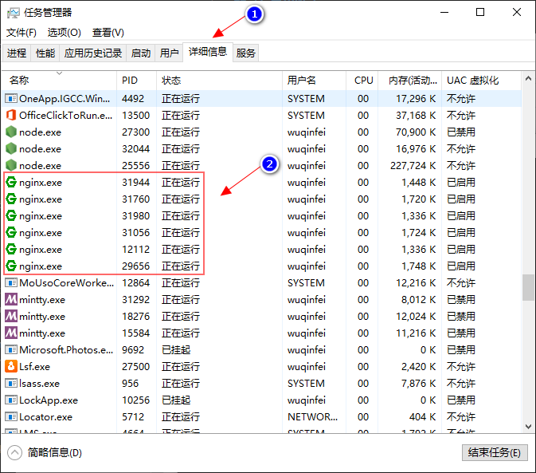

# Nginx

## 1. 常用命令

```shell
# 切换到 nginx 根目录
cd /D D:\dev\software\nginx-1.18.0

# 启动
start nginx

# 启动 时指定配置文件
start nginx -c .\conf\nginx_lxw.conf

# 停止
nginx -s stop
```

## 2. 注意

多次执行 `start nginx` 命令 会启动多个 Nginx 实例，可以在 任务管理器 中将其关闭：

