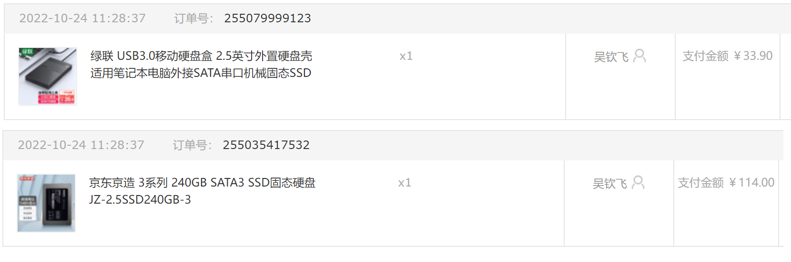
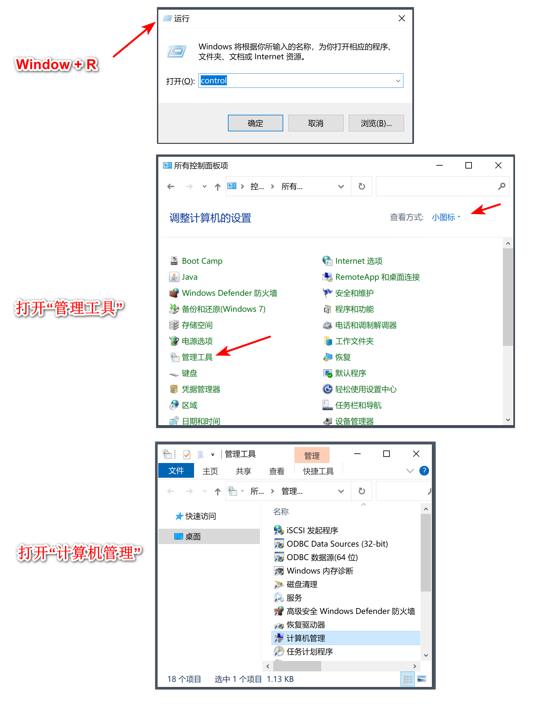
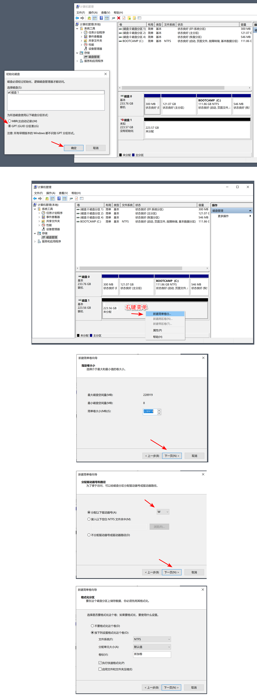

# DIY 移动硬盘

## 1. 准备

1. 绿联 USB3.0移动硬盘盒 2.5英寸外置硬盘壳 适用笔记本电脑外接SATA串口机械固态SSD
2. 京东京造 3系列 240GB SATA3 SSD固态硬盘 JZ-2.5SSD240GB-3

直接把硬盘塞进硬盘盒，然后插到电脑上。

## 2. 格式化硬盘

### 2.1. 磁盘管理

1. 打开控制面板
   * window + R，打开“运行”
   * 输入 control，打开控制面板
2. 打开 “管理工具”
3. 找到 “计算机管理”

### 2.2. 格式化

格式化“磁盘1”

