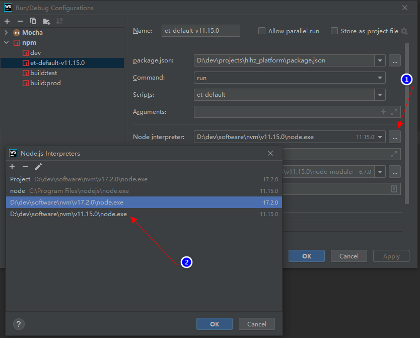

# nodejs多版本管理 —— nvm

[[toc]]

## 1. 说明

使用 nvm 安装并切换多个版本 node.js

## 2. 安装

下载 `nvm-setup.zip` ：[https://github.com/coreybutler/nvm-windows/releases](https://github.com/coreybutler/nvm-windows/releases)

解压并安装。

## 3. 常用命令

>注意：使用管理员权限打开 CMD


### 3.1. 查看可用版本

```shell
nvm ls available

|   CURRENT    |     LTS      |  OLD STABLE  | OLD UNSTABLE |
|--------------|--------------|--------------|--------------|
|    18.2.0    |   16.15.1    |   0.12.18    |   0.11.16    |
|    18.1.0    |   16.15.0    |   0.12.17    |   0.11.15    |
|    18.0.0    |   16.14.2    |   0.12.16    |   0.11.14    |
|    17.9.1    |   16.14.1    |   0.12.15    |   0.11.13    |
```

### 3.2. 安装指定版本

```shell
# 安装具体的版本
nvm install 17.2.0

# 如果（因为网络原因）安装失败，则删除并重新安装
nvm uninstall 17.2.0

# 安装大版本的最新版，如下命令会安装 11.15.0
nvm install 11
```

，就 `nvm uninstall 17.2.0` 

### 3.3. 查看当前系统的 node.js

```shell
nvm ls

  * 17.2.0 (Currently using 64-bit executable)
    17.1.0
    12.22.7
```

### 3.4. 使用已安装的版本

```shell
nvm use 12.22.7

    Now using node v12.22.7 (64-bit)
```

## 4. 在 webstorm 中的应用

### 4.1. 设置项目默认的 node.js 版本


### 4.2. 对不同的命令设置不同的 node.js 版本

打开配置：


设置：

