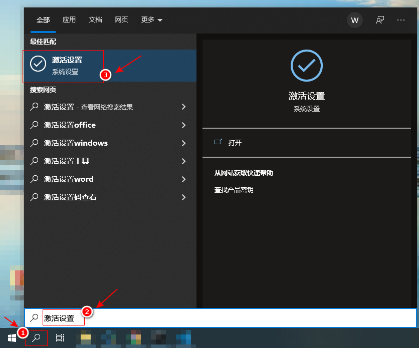
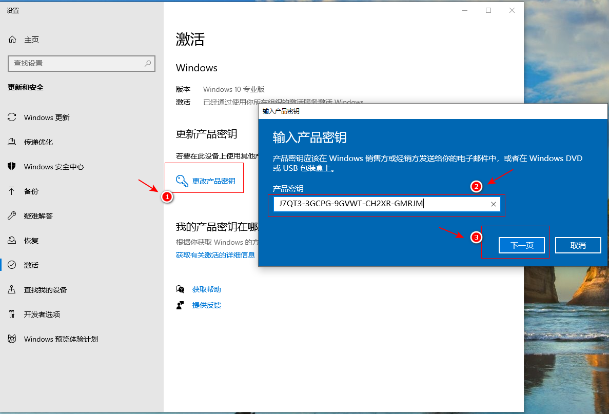
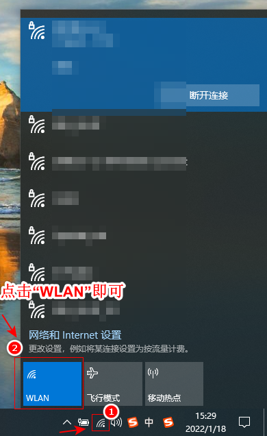
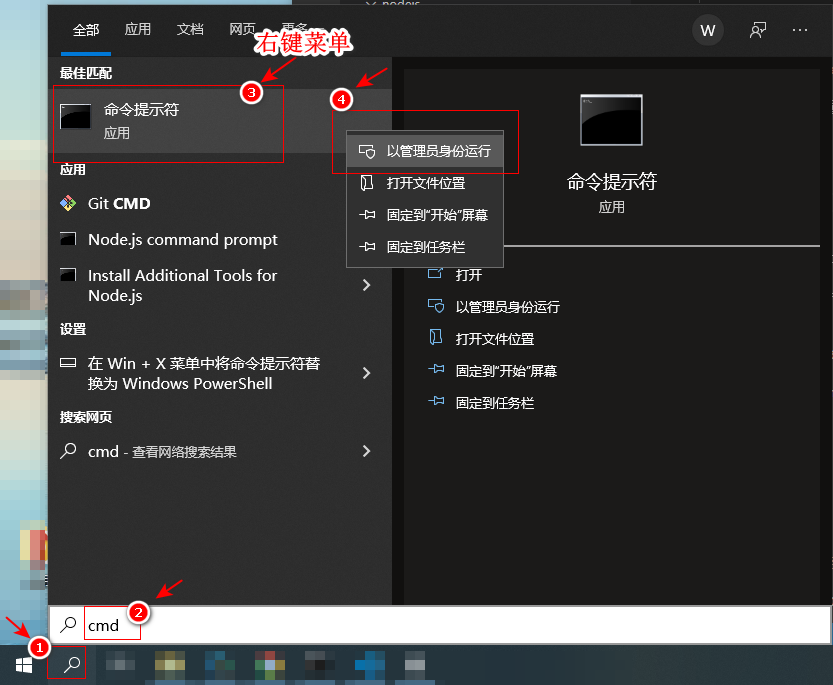
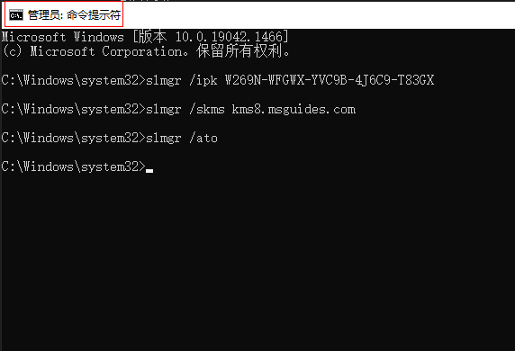

# win10家庭普通版升级专业版

## 1. 说明

先升级，再激活。

## 2. 升级

1. 打开激活界面

    * 

2. 更换密钥

    * J7QT3-3GCPG-9GVWT-CH2XR-GMRJM

    * 

    * 点击完“下一步”，等待验证成功后 不要点击“升级”

3. 断开网络

    * 

4. 点击“升级”，待重启三四次后即可升级 pro 成功，此时 win10 未激活

## 3. 激活

1. 打开 CMD（以管理员权限）

    * 

2. 执行以下三行脚本命令

    * 使用管理员权限打开 CMD，执行以下脚本

      ```shell
      slmgr /ipk W269N-WFGWX-YVC9B-4J6C9-T83GX

      slmgr /skms kms8.msguides.com

      slmgr /ato
      ```

    * 

3. 验证是否激活成功

    * 

## 4. 参考

* [win10家庭版升级到专业版密钥 —— 简书](https://www.jianshu.com/p/3f9e2368e546)

  * J7QT3-3GCPG-9GVWT-CH2XR-GMRJM

* [Windows 10 Pro Product Key Free](https://downloadappsforfree.com/windows-10-pro-product-key-free/)

  * Method 2: You use KMS client key to activate your Windows 10 Pro manually
