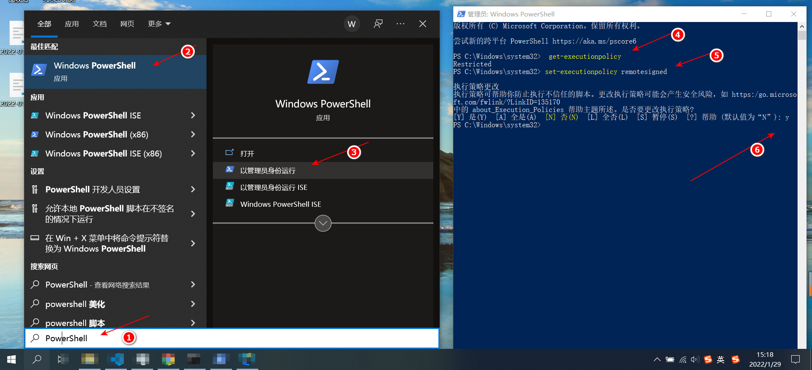

# PowerShell 禁止运行脚本的问题.md

## 说明

在执行脚本时，突然遇到如下问题：

```text
vue : 无法加载文件 C:\Users\wuqinfei\AppData\Roaming\npm\vue.ps1，因为在此系统上禁止运行脚本。
有关详细信息，请参阅 https:/go.microsoft.com/fwlink/?LinkID=135170 中的 about_Execution_Policies。
所在位置 行:1 字符: 1
+ vue create test-eslint-airbnb-ts-vue
+ ~~~
    + CategoryInfo          : SecurityError: (:) []，PSSecurityException
    + FullyQualifiedErrorId : UnauthorizedAccess
```

在计算机上启动 Windows PowerShell 时，执行策略很可能是 Restricted（默认设置）。

Restricted 执行策略不允许任何脚本运行。

可以重新设置策略。

## 步骤

```shell
# 查看当前策略
get-executionpolicy

  # Restricted
  
# 设置策略
set-executionpolicy remotesigned

get-executionpolicy
  
  # RemoteSigned
```



## 参考

* [PowerShell：因为在此系统上禁止运行脚本，解决方法](https://www.jianshu.com/p/4eaad2163567)
