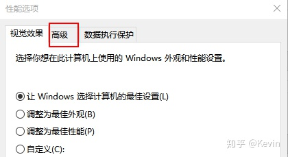
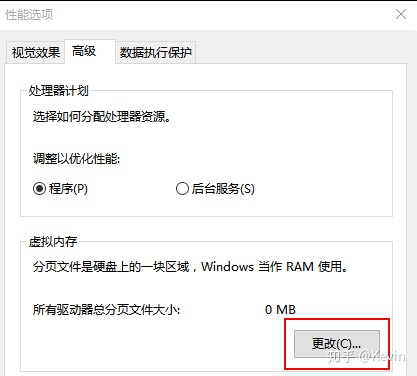
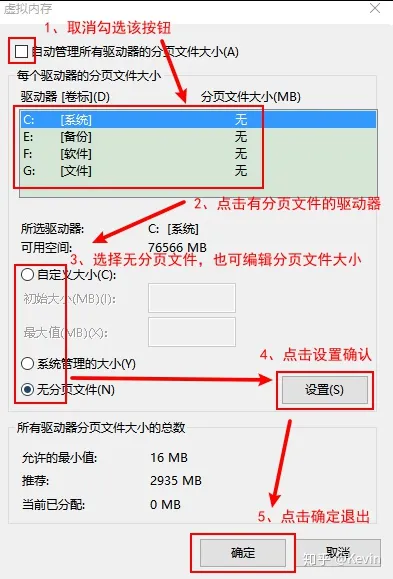

# Win10 关闭虚拟内存

## 1. 介绍

虚拟内存的作用是把一部分硬盘的储存模拟成内存条的运存，以达到增大运存的目的。

如果内存条提供的运存能满足日常需要，推荐关闭虚拟内存。

硬盘的性能远不足内存条，所以系统在使用虚拟内存时性能会受影响。

虚拟内存涉及到读写操作，还会对固态硬盘的寿命产生影响

## 2. 步骤

1. 搜索 “查看高级系统配置”
2. 点击性能标签下的设置
   * 
3. 点击高级标签
   * 
4. 点击更改
   * 
5. 按如下流程编辑
   * 

之后所有窗口点击确定退出，并重启系统，重启完成后再次按流程到虚拟内存界面查看是否取消成功

## 3. 参考

* [Win10关闭虚拟内存](https://zhuanlan.zhihu.com/p/227725177)
