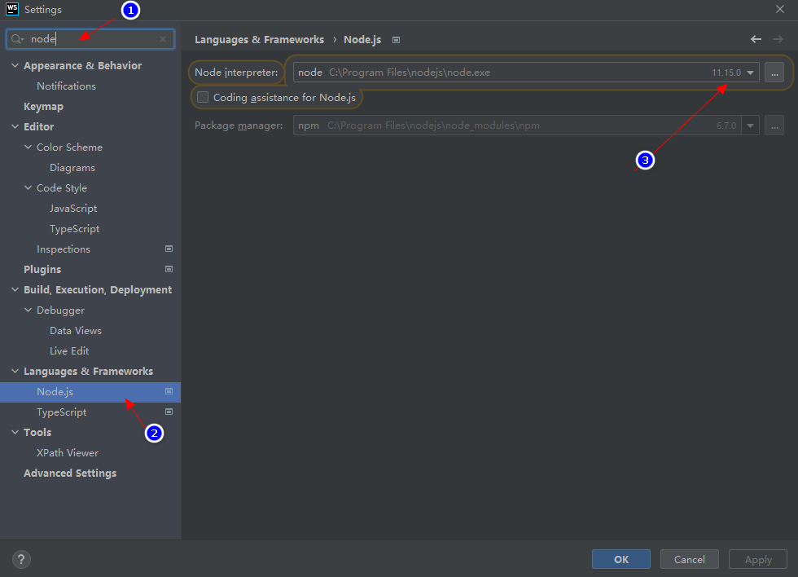

# nodejs多版本管理

[[toc]]

## 1. 说明

使用 nvm 安装并切换多个版本 node.js

## 2. 安装

安装包下载地址：

* https://github.com/coreybutler/nvm-windows/releases

## 3. 常用命令

>注意：使用管理员权限打开 CMD


### 3.1. 查看可用版本

```shell
nvm ls available

    |   CURRENT    |     LTS      |  OLD STABLE  | OLD UNSTABLE |
    |--------------|--------------|--------------|--------------|
    |    17.2.0    |   16.13.1    |   0.12.18    |   0.11.16    |
    |    17.1.0    |   16.13.0    |   0.12.17    |   0.11.15    |
    |    17.0.1    |   14.18.2    |   0.12.16    |   0.11.14    |
    |    17.0.0    |   14.18.1    |   0.12.15    |   0.11.13    |
    |   16.12.0    |   14.18.0    |   0.12.14    |   0.11.12    |
    |   16.11.1    |   14.17.6    |   0.12.13    |   0.11.11    |
    |   16.11.0    |   14.17.5    |   0.12.12    |   0.11.10    |
    |   16.10.0    |   14.17.4    |   0.12.11    |    0.11.9    |
    |    16.9.1    |   14.17.3    |   0.12.10    |    0.11.8    |
    |    16.9.0    |   14.17.2    |    0.12.9    |    0.11.7    |
    |    16.8.0    |   14.17.1    |    0.12.8    |    0.11.6    |
    |    16.7.0    |   14.17.0    |    0.12.7    |    0.11.5    |
    |    16.6.2    |   14.16.1    |    0.12.6    |    0.11.4    |
    |    16.6.1    |   14.16.0    |    0.12.5    |    0.11.3    |
    |    16.6.0    |   14.15.5    |    0.12.4    |    0.11.2    |
    |    16.5.0    |   14.15.4    |    0.12.3    |    0.11.1    |
    |    16.4.2    |   14.15.3    |    0.12.2    |    0.11.0    |
    |    16.4.1    |   14.15.2    |    0.12.1    |    0.9.12    |
    |    16.4.0    |   14.15.1    |    0.12.0    |    0.9.11    |
    |    16.3.0    |   14.15.0    |   0.10.48    |    0.9.10    |
```

### 3.2. 安装指定版本

```shell
# 安装具体的版本
nvm install 17.2.0

# 安装大版本的最新版，如下命令会安装 11.15.0
nvm install 11
```

如果安装失败（如 npm 安装失败），就 `nvm uninstall 17.2.0` 删除版本 node 后重新安装

### 3.3. 查看当前系统的 node.js

```shell
nvm ls

  * 17.2.0 (Currently using 64-bit executable)
    17.1.0
    12.22.7
```

### 3.4. 使用已安装的版本

```shell
nvm use 12.22.7

    Now using node v12.22.7 (64-bit)
```

## 4. 在 webstorm 中的应用

### 4.1. 设置项目默认的 node.js 版本



### 4.2. 对不同的命令设置不同的 node.js 版本

打开配置：


设置：

