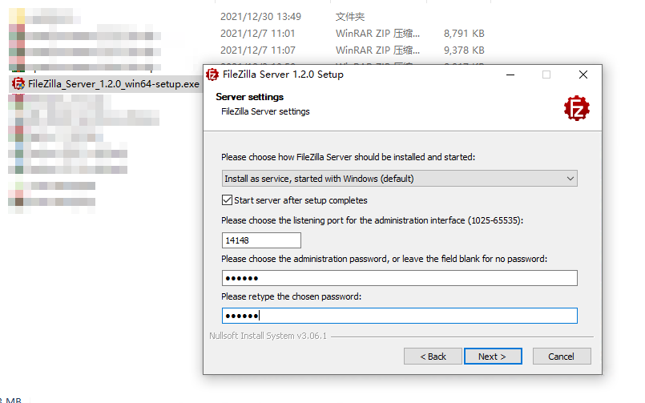
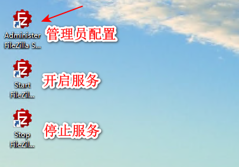
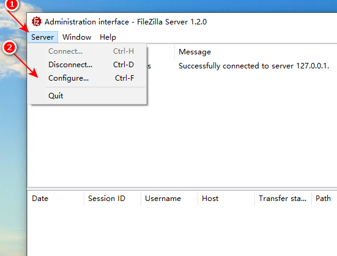
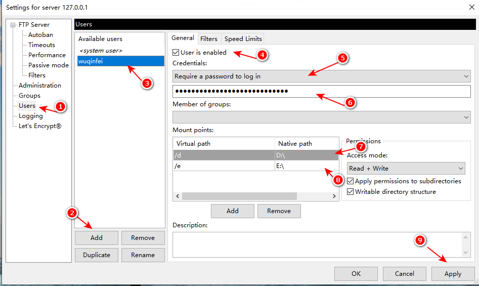
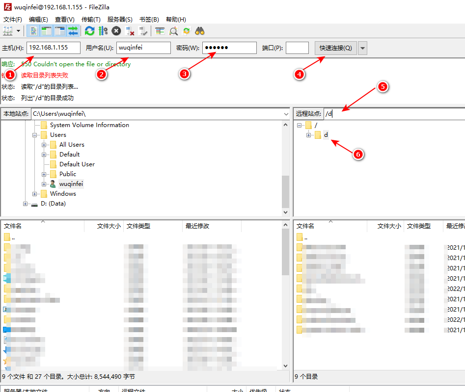

# FTP - FileZilla

## 1. 说明

开启 FTP server，通过 FTP client 连接 FTP server。

## 2. 下载

到官网下载 server 和 client：

[https://filezilla-project.org/](https://filezilla-project.org/)

## 3. server

1. 安装

    * 

2. 开启服务，并打开“管理员配置”

    * 

3. 配置用户及可访问的目录

    * 开配置界面

        * 

    * 进行配置

        * 

## 4. client

连接 server 即可：

## 5. 注意

FTP server 需要关闭防火墙，否则其他电脑无法连接 server 的 TCP 端口。

## 6. 参考

* [FileZilla每次启动出现“filezilla.xml无法加载”错误，何故？](https://www.oschina.net/question/140230_65123?sort=time)
