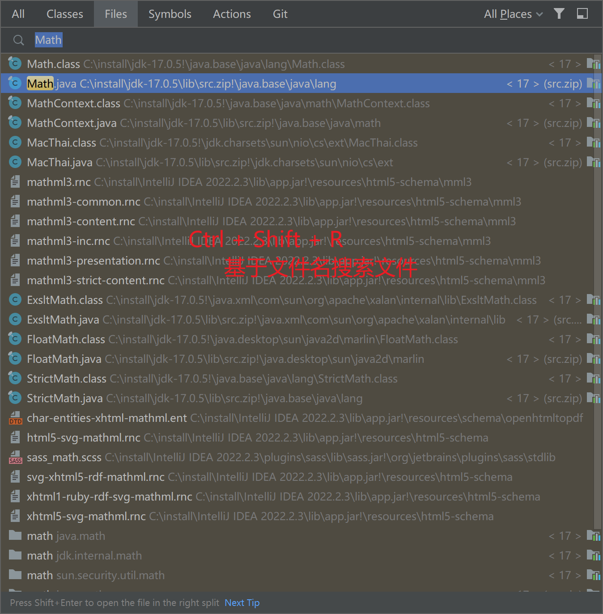
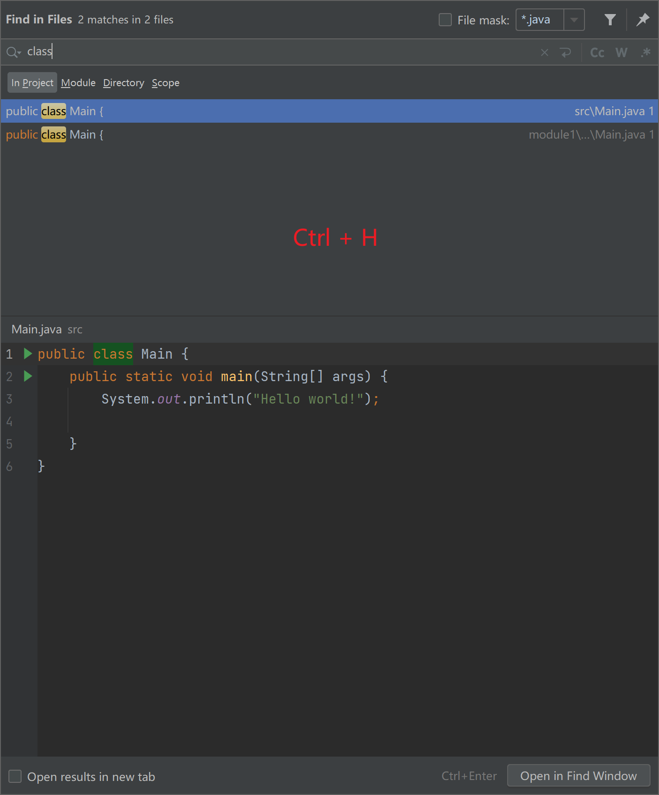
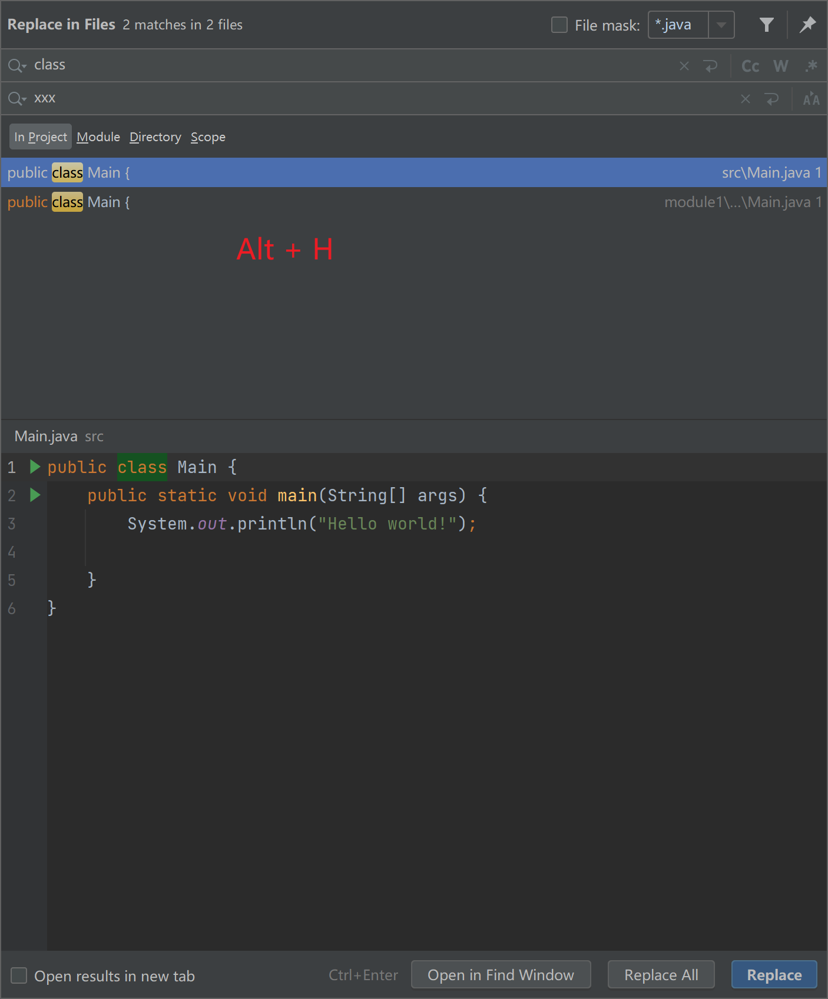
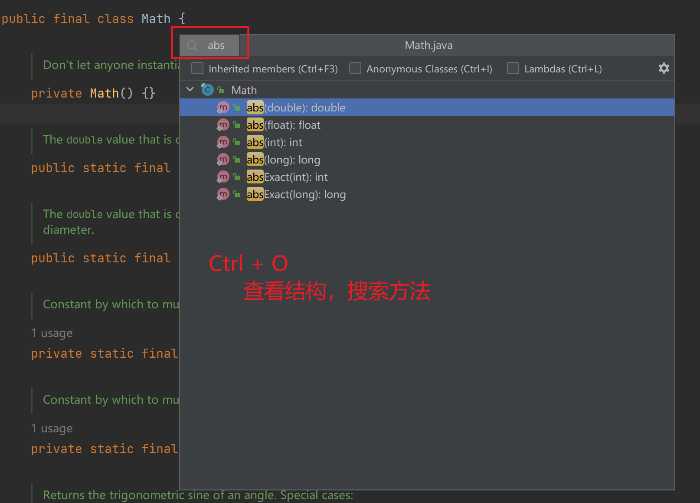
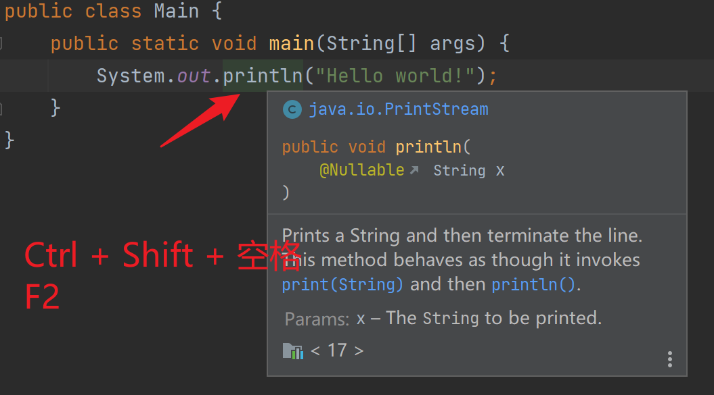
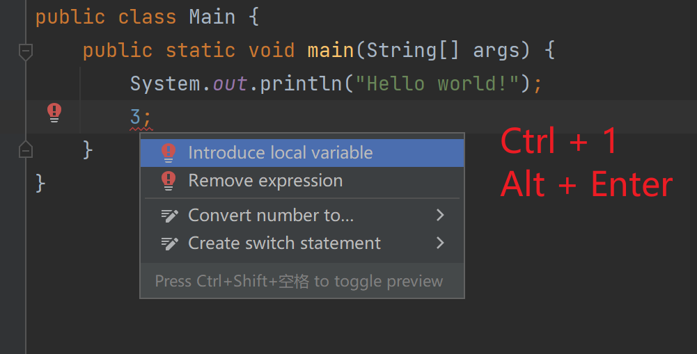

# IDEA 快捷键

[[toc]]

>基础 keymap 为 Eclipse

## Editor Actions

### Move Statement Down (Alt + 向下箭头)

向下移动语句

### Move Statement Up (Alt + 向上箭头)

向上移动语句

### Duplicate Entire Lines ( Ctrl + Alt + 向下箭头 )

复制行

### Delete Line ( Ctrl + D )

删除行

## others

### Go to File... ( Ctrl + Shift + R )

### Find in Files ( Ctrl + H)

### Replace in Files ( Alt + H) -- 自定义

### View Structure ( Ctrl + O )

### Quick Document ( Ctrl + Shift + 空格 ) / (F2)

### Show Quick Fixes ( Ctrl + 1 ) / ( Alt + Enter )

