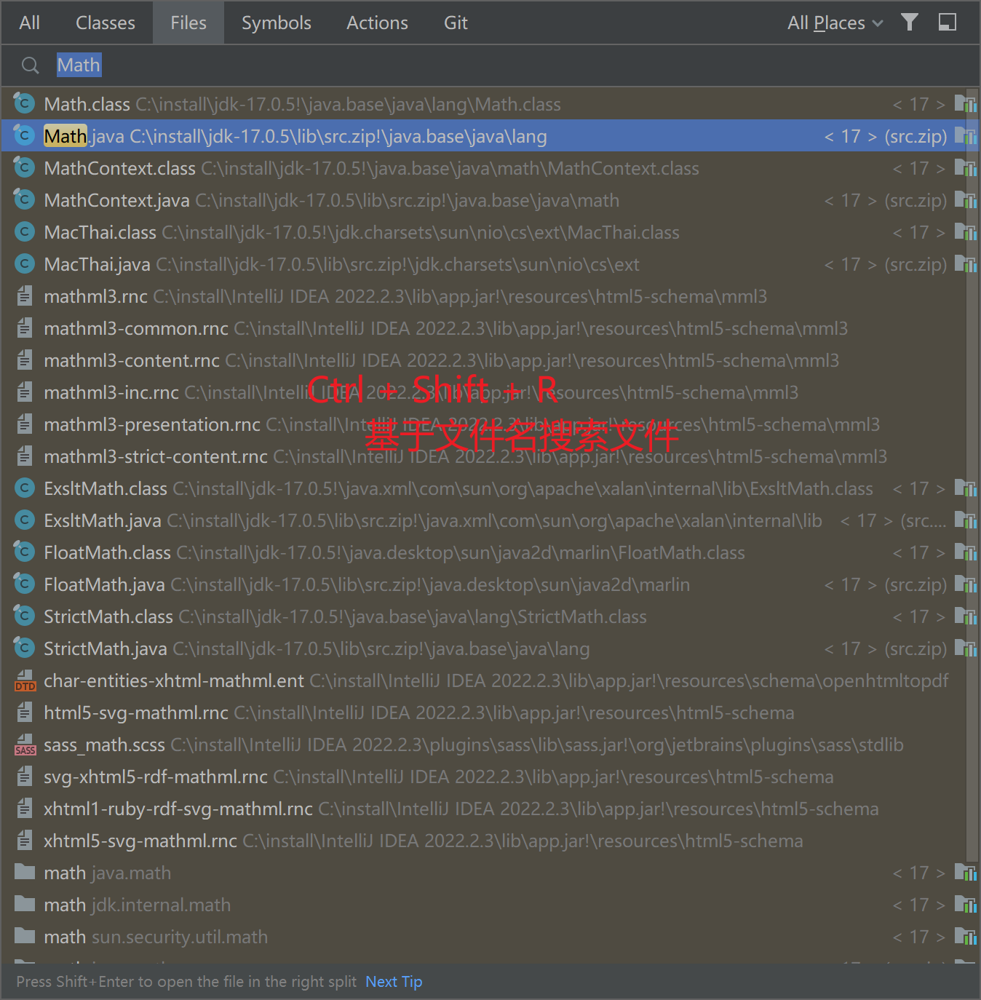
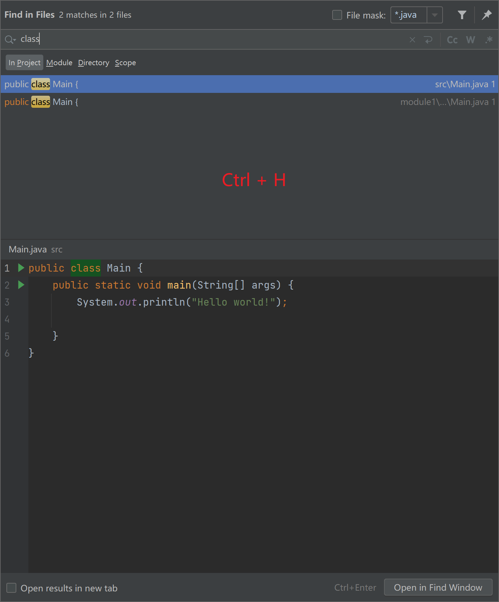
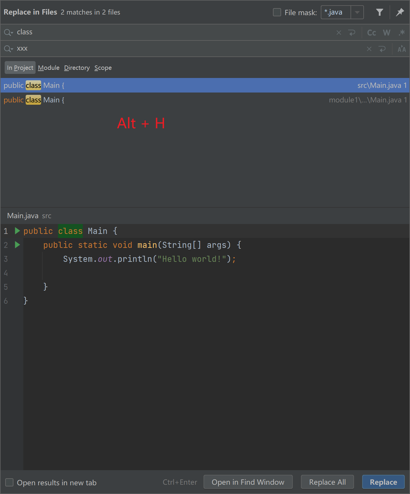
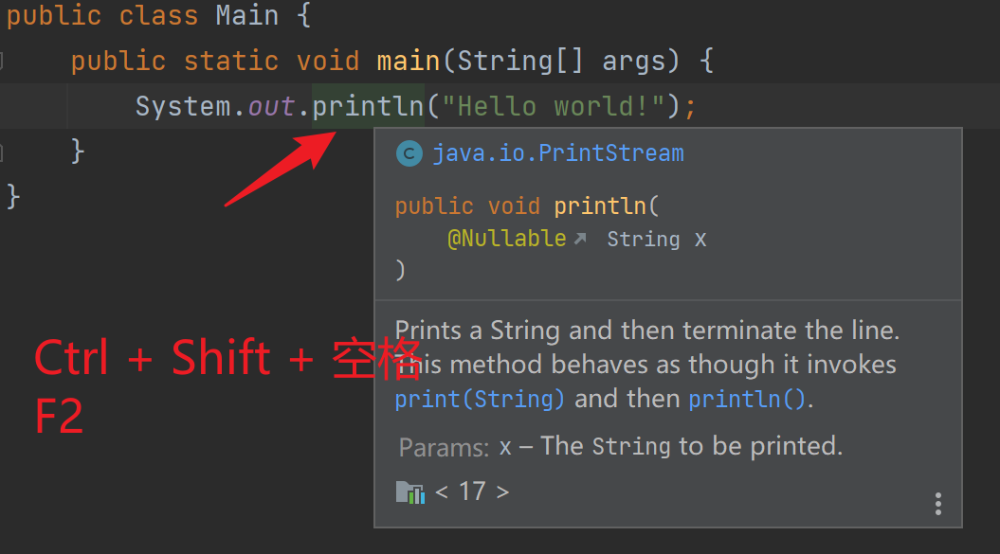
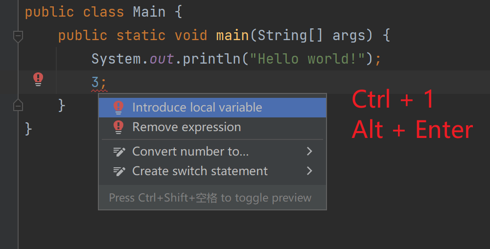

<!--#region
@author 吴钦飞
@email wuqinfei@qq.com
@create date 2025-07-12 18:13:34
@modify date 2025-12-06 09:16:25
@desc [description]
#endregion-->


# IDEA 快捷键

>基础 keymap 为 Eclipse

## 常用

查看类的继承结构: `F4`


查看类的成员列表: `Ctrl + O`


查看方法的参数信息: `Alt + P` (自定义， View -> Parameter Info)


创建单元测试:

1. 选中类名
2. 右键菜单 -> Generate... -> Test...

## 1. Editor Actions

### 1.1. Add or Remove Caret ( Alt + Shift + Click )

添加或删除光标，用于多行、多位置同时操作。

适合不在同一列的多个位置同时操作。

### 1.2. Create Rectangular Selection on Mouse Drag ( Alt + Click )

按住 Alt，通过左键拖拽多列选择

### 1.3. Column Selection Mode ( Alt + Shift + Insert)

切换多列操作模式

### 1.4. Duplicate Entire Lines ( Ctrl + Alt + 向下箭头 )

复制行

### 1.5. Delete Line ( Ctrl + D )

删除行

### 1.6. Toggle Case ( Ctrl + Shift + U )

切换大小写

### 1.7. Join Lines ( Ctrl + Shift + J )

合并行

### 1.8. Complete Current Statement ( Ctrl + Shift + Enter)

代码补全，补全当前语句，如添加分号。

## 2. Code (Main Menu)

### 2.1. Comment with Line Comment ( Ctrl + / )

（取消）行注释

### 2.2. Comment with Block Comment ( Ctrl + Shift + / )

（取消）块注释

### 2.3. Move Line Down ( Alt + 向下箭头 ) -- 自定义

向下移动选中的语句

### 2.4. Move Line Up ( Alt + 向上箭头 ) -- 自定义

向上移动选中的语句

### 2.5. Generate... ( Alt + Insert )

打开 generate 面板，可生成 构造函数、访问器

## 3. Navigate ( Main Menu )

### 3.1. View Structure ( Ctrl + O )


查看类的结构，查看所有方法

### 3.2. Type Hierarchy ( F4 )

查看类的继承关系

### 3.3. Show UML Popup ( Ctrl + Alt + U )

类的查看 UML 图

## 4. Main Menu

### 4.1. Close Tab (Ctrl + W) -- 自定义

Window -> Editor Tabs -> Close Tab

关闭当前编辑器中的 tab

### 4.2. Parameter Info （Ctrl + P） -- 自定义

View -> Parameter Info

光标移入小括号内，按 `Ctrl + P` 显示方法的参数列表

### 4.3. Introduce Variable... ( Alt + Shift + L )

Refactor -> Extract/Introduce

将表达式抽取为变量。

对于单行表达式，可以快速设置 变量类型及变量标识符。

## 5. others

### 5.1. Go to File... ( Ctrl + Shift + R )



### 5.2. Find in Files ( Ctrl + H)



### 5.3. Replace in Files ( Alt + H) -- 自定义




### 5.4. Quick Document ( Ctrl + Shift + 空格 ) / (F2)



### 5.5. Show Quick Fixes ( Ctrl + 1 ) / ( Alt + Enter )



### 5.6. Reload All from Disk ( F1 ) -- 自定义

Reload All from Disk

## 6. 设置

### 6.1. 代码补全（字母不区分大小写）

位置： Settings -> Editor -> General -> Code Completion

不勾选 "Match case"

## 7. 代码片段

### 7.1. 打印语句

```java
// sout
System.out.println();
```

### 7.2. for

```java
int[] arr = {1, 2, 3, 4, 5};

// arr.for
for (int i : arr) {
}

// arr.fori
for (int i = 0; i < arr.length; i++) {
}

// arr.forr
for (int i = arr.length - 1; i >= 0; i--) {
    
}
```

## 8. 插件

### 8.1. PTG

Quick Generation JavaBean Quick Generation 

SQL Quick Generation 

JVM arguemnts Quick Generation 

Spring Configuration