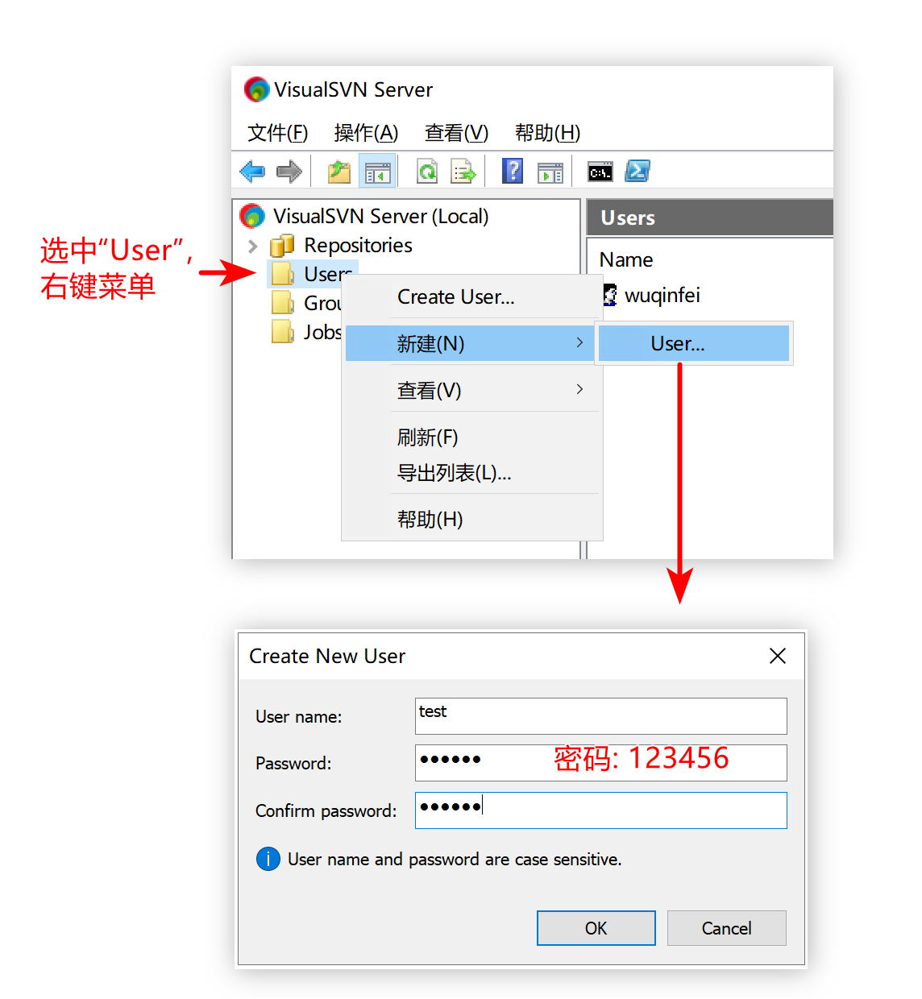
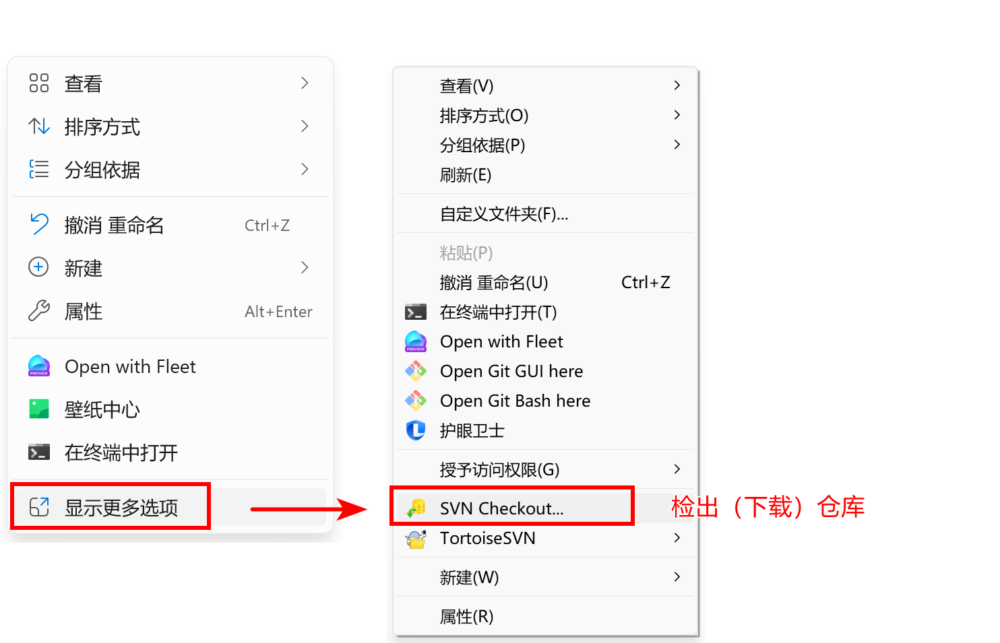
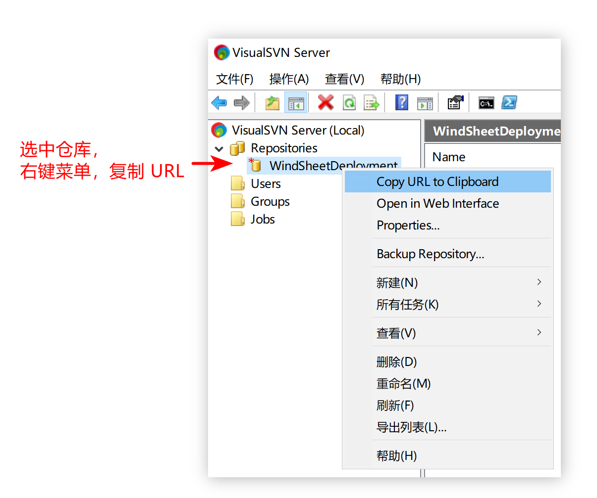
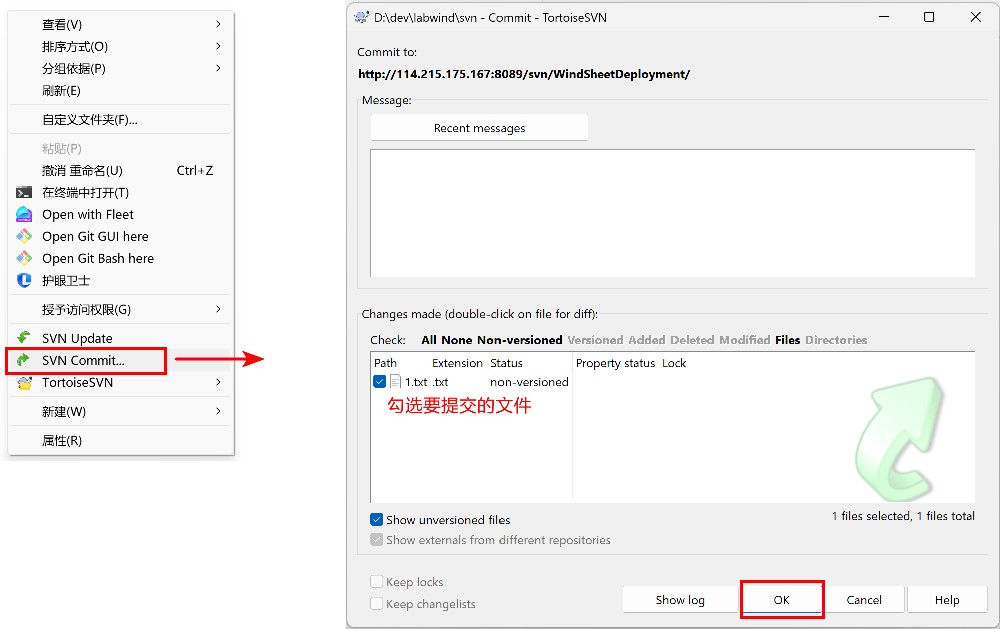
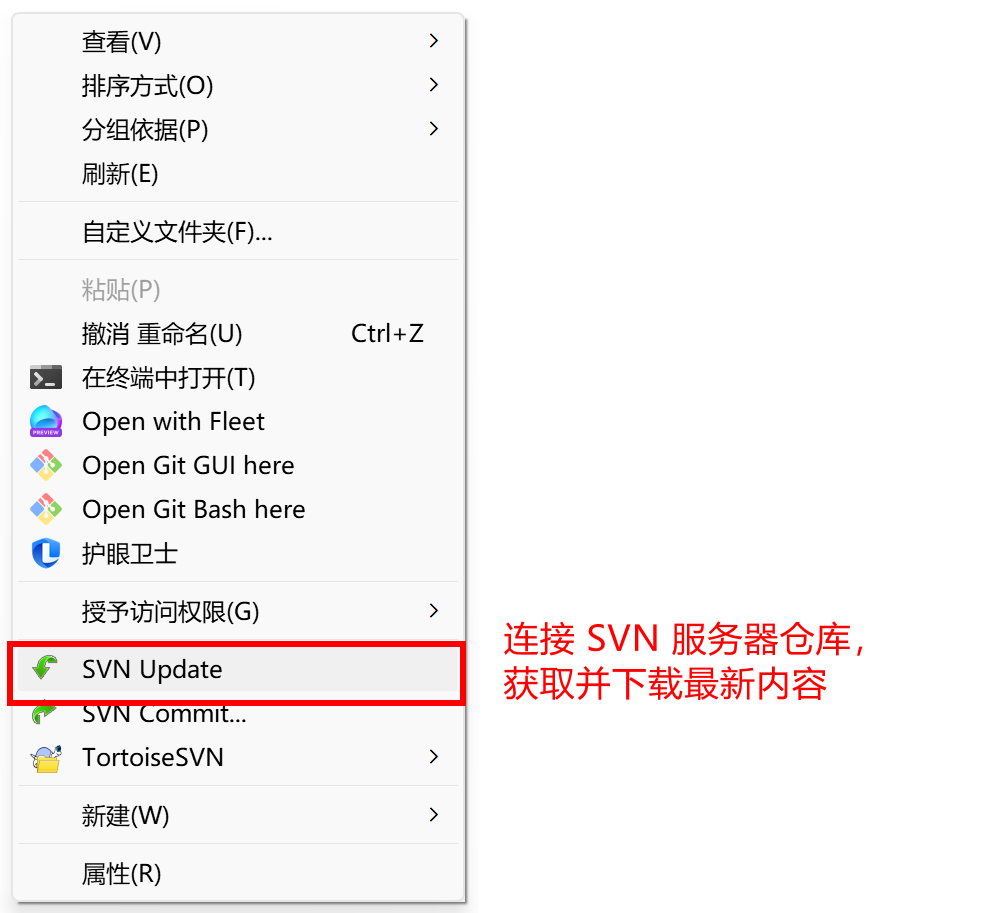

<!--#region
@author 吴钦飞
@email wuqinfei@qq.com
@create date 2025-08-21 09:54:20
@modify date 2025-08-21 11:10:26
@desc [description]
#endregion-->

# SVN 使用教程

>作者: 吴钦飞
>创建日期: 2025-08-21 09:54:20
>修改日期: 2025-08-21 10:51:18

## 1. 介绍

编撰此文档的目的是为说明如何使用 SVN。

概要:

* 打开 SVN server
* 创建仓库
* 创建 SVN 账号
* 安装 SVN 客户端
* 下载仓库
* 上传文件
* 更新仓库

## 2. 打开 SVN server

启动 SVN Server

应用程序位置: `C:\Program Files\VisualSVN Server\bin\VisualSVN Server.msc`

## 3. 创建仓库


## 4. 创建 SVN 账号

创建账户 test/123456



## 5. 安装 SVN 客户端

下载:

* [TortoiseSVN-1.14.5.29465-x64-svn-1.14.2.msi](https://webcdn.m.qq.com/spcmgr/download/TortoiseSVN-1.14.5.29465-x64-svn-1.14.2.msi)


安装: 

* 点击 “next” 即可
* 可以更改安装路径

## 6. 下载仓库

第 1 步: 在本地创建存放仓库的目录，如下

`D:\dev\labwind\svn`

第 2 步: 在 目录 空白处 右键菜单



第 3 步: 获取仓库地址 `http://114.215.175.167:8089/svn/WindSheetDeployment/`



第 4 步: 输入仓库地址，进行下载


注意事项:

* 前端编译后代码（如 `dist` 文件夹），请转为压缩文件（`dist.zip`）再进行上传

## 7. 上传文件

第 1 步: 在仓库新建 `1.txt` 文件，内容如下

```text
仅用于测试
```

第 2 步: 提交文件



## 8. 更新仓库


