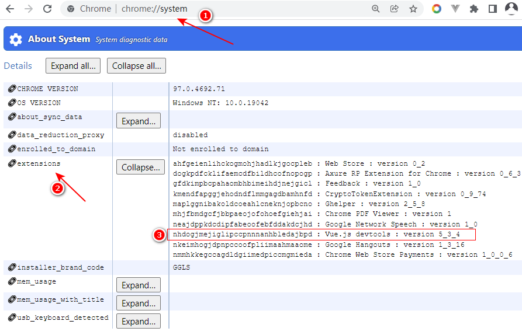

# Vue 开发工具

## 1. 下载

[vue_devtools_5.3.4.zip](/download/vue_devtools_5.3.4.zip)

## 2. 安装

参考 [vue调试工具vue-devtools的安装](https://zhuanlan.zhihu.com/p/142411207) 中的“安装离线的 Chrome 插件”

## 3. 其他

查看 Chrome 已安装的插件：

* 点击 [chrome://system/](chrome://system/)，查看 Chrome 已安装的插件列表，获取插件 ID
* 

查看 Chrome 在磁盘上安装的插件： 

* `C:\Users\${user}\AppData\Local\Google\Chrome\User Data\Default\Extensions\`
* 

## 4. 参考

* [vue调试工具vue-devtools的安装](https://zhuanlan.zhihu.com/p/142411207)
* [Get a list of installed chrome extensions](https://superuser.com/questions/1164152/get-a-list-of-installed-chrome-extensions)