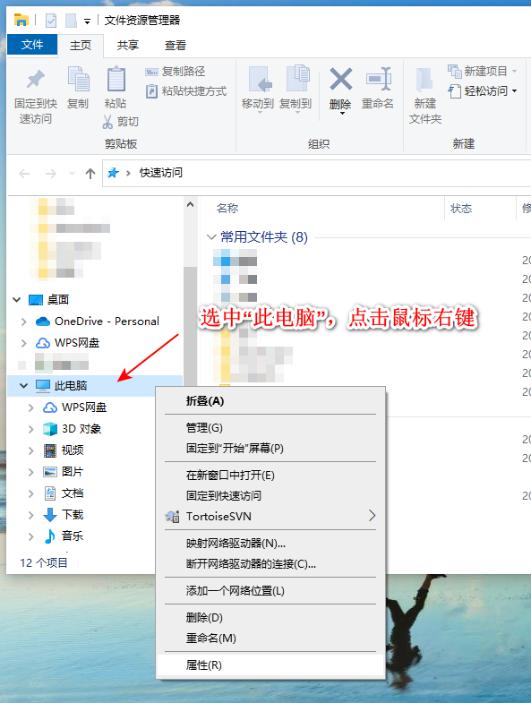
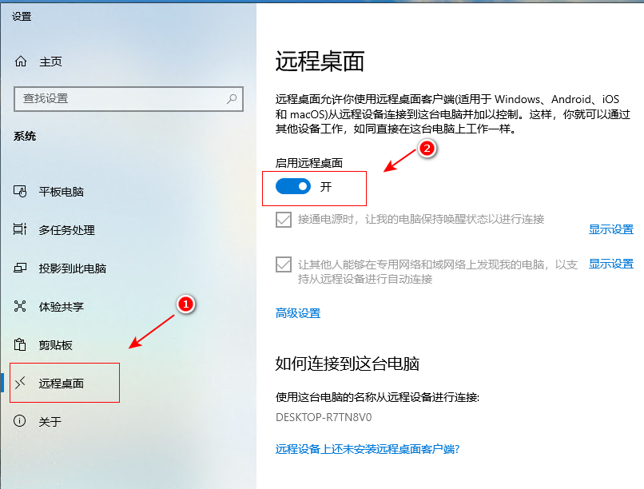
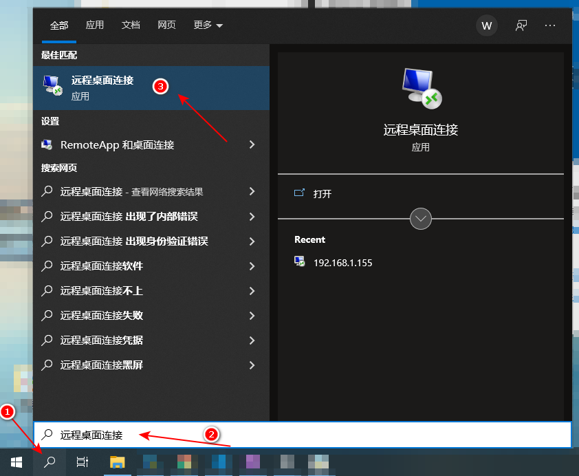
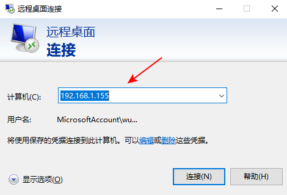

# win10 远程桌面连接

## 1. 说明

使用 win10 远程桌面连接控制另一台 win10 的电脑。

## 2. 步骤

>控制者 要操作 受控者。

1. 受控者，设置允许其他电脑远程桌面连接：

    * “此电脑” 右键菜单 --> “属性”

        *  

    * 开启远程桌面    

        *  

2. 控制者，连接远程电脑：

    * 打开“远程桌面连接”软件

        *  

    * 连接受控者的 IP，输入登录账号
    
        *  

## 3. 注意

win10 家庭版（受控者）不支持开启远程桌面连接的功能。

受控者要开启电脑。

受控者如果已登录账号，需要注销。

## 4. 参考

* [win10远程桌面](https://www.51dongshi.com/ebedfaccrc.html)