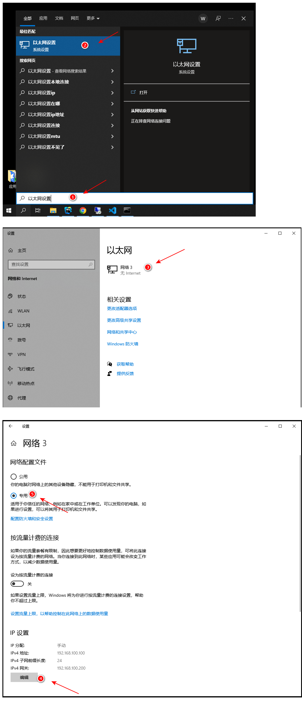

# 两电脑通过一根网线连接

## 1. 环境

* 一根网线（交叉线）
* 两个电脑（win10 系统）
  * 电脑A
  * 电脑B

## 2. IP v4 配置

### 2.1. 电脑A

网络配置文件：

* 专用


IP 设置：

```text
IPv4地址
  192.168.100.100

子网掩码
  255.255.255.0

默认网关（电脑B的IP地址）
  192.168.100.200
```

### 2.2. 电脑B

网络配置文件：

* 专用


IP 设置：

```text
IPv4地址
  192.168.100.200

子网掩码
  255.255.255.0

默认网关（电脑A的IP地址）
  192.168.100.100
```

## 3. 图示


